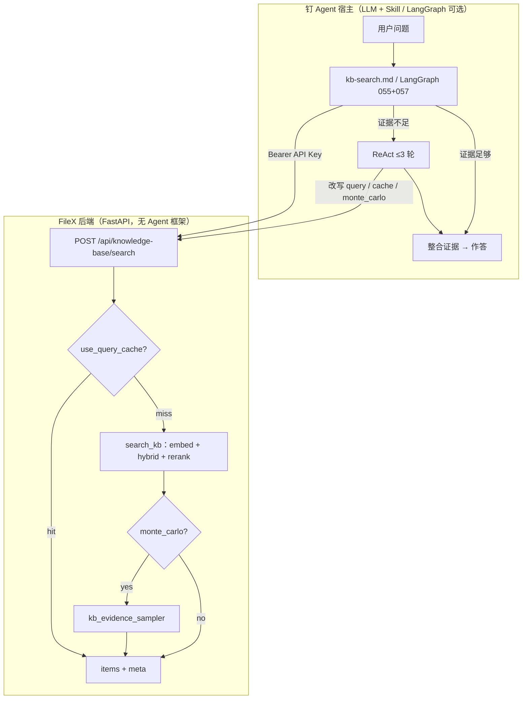
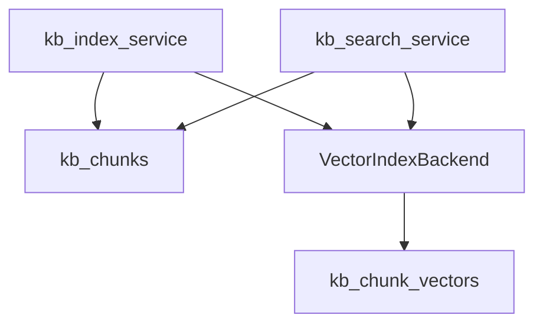

# FileX

AI 智能体资料库：个人 / 集团知识空间、RAG 检索、正文提取与向量索引、Wiki 互联、钉技能集成。

- **正式站点**：`https://ding.yyyou.top`（对外产品名「钉」）
- **开发规范与文档索引**：[`BestPractice.md`](BestPractice.md)（Codex 入口 [`AGENTS.md`](AGENTS.md)）
- **Backlog**：[`specs/_project/project-todo.md`](specs/_project/project-todo.md)

---

## 核心能力

| 能力 | 说明 |
|------|------|
| **资料管理** | 文件夹、workspace 隔离、MD5 去重、预览与 Markdown 笔记 |
| **正文提取** | Office / PDF / 图片等多格式 → 结构化笔记（legacy / Docling / MinerU / Insavlo 等路由） |
| **向量索引** | RabbitMQ 异步流水线；Ollama `bge-m3` 嵌入；pgvector HNSW + FTS hybrid |
| **RAG 检索** | hybrid RRF、TEI rerank、查询缓存、蒙特卡洛采样、文件名/ID 检索 |
| **Wiki 互联** | 标签关系图、wiki-path 补全、Agent 检索 hints |
| **钉技能** | 标准 Skill 包对接 OpenClaw / Claude Code / Codex 等；HTTP API Key 鉴权 |
| **企业能力** | 共享空间、组织/角色/目录 ACL（059，生产默认 S1 legacy grants） |
| **OKF 互操作** | Google OKF bundle 导入/导出/校验（064） |

**架构原则**：FileX 后端提供**确定性检索 API**，不在 FastAPI 内嵌 Chat LLM 或 Agent 编排框架；ReAct / LangGraph 运行在**钉 Agent 宿主侧**。

---

## 快速开始（本地）

```bash
./start.sh                                    # Docker: postgres/rabbitmq/redis/ollama/filex/kb-indexer 等；kb-extract 宿主机
cd frontend && npm run dev                    # :5173 → 代理 /api :8000
cd backend && alembic upgrade head            # 若未走 start.sh 迁移
cd frontend && npm run build && cd ../backend && pytest   # 常见验证
```

**技术栈**：FastAPI + PostgreSQL（pgvector + zhparser）+ Alembic + RabbitMQ + Redis | React 19 + Vite + Ant Design 5 | Workers：`kb-indexer`、`kb-extract`、`kb-rerank`、`filex-mineru`、`filex-docling` | 嵌入：`filex-ollama`（Compose 内网 `http://filex-ollama:11434`）

**Compose 文件**：

| 文件 | 用途 |
|------|------|
| [`docker/docker-compose.yml`](docker/docker-compose.yml) | 默认服务定义 |
| [`docker/docker-compose.local.yml`](docker/docker-compose.local.yml) | 本地端口与路径 overlay |
| [`docker/docker-compose.prod.yml`](docker/docker-compose.prod.yml) | 生产 secrets overlay |

本地 API 默认 `http://127.0.0.1:8000`（`start.sh` 容器映射 `:8001→8000` 时访问 `:8001`）。

---

## 文档索引

| 需要什么 | 去哪 |
|----------|------|
| 功能规格与任务 | `specs/<feature-id>/{spec,plan,tasks}.md` |
| 部署 / 生产运维 | [`specs/_project/deployment-checklist.md`](specs/_project/deployment-checklist.md) |
| 提取与索引流水线 | [`specs/_project/extract-index-pipeline.md`](specs/_project/extract-index-pipeline.md) |
| KB 流水线系统日志 | [`specs/067-kb-pipeline-operation-logs/spec.md`](specs/067-kb-pipeline-operation-logs/spec.md) 附录 A |
| 智能体 HTTP API | [`skill/ding/references/filex-agent-api.md`](skill/ding/references/filex-agent-api.md) |
| 钉 LangGraph 运维 | [`specs/_project/ding-langgraph-host-ops-checklist.md`](specs/_project/ding-langgraph-host-ops-checklist.md) |
| Docker 构建细节 | [`docker/BUILD.md`](docker/BUILD.md) |
| 架构 / 跨模块探索 | `graphify query` 或 `graphify-out/wiki/index.md` |

---

## Agentic 检索（028）与 LangGraph（055 / 057）

FileX **已实现** Agentic 检索增强（[`specs/028-kb-agentic-retrieval/`](specs/028-kb-agentic-retrieval/spec.md)），但 **未在 FastAPI 内**使用 LangGraph / LangChain / LlamaIndex。编排发生在 **钉 Agent 宿主**；FileX 只提供 **HTTP Tool**（无服务端 Chat LLM）。

### 028 三模块（FileX 后端）

| 模块 | 说明 | 实现位置 |
|------|------|----------|
| **A** 查询缓存 | 语义相近 query 复用 chunk 级 search 快照 | `backend/services/kb_search_cache_service.py` |
| **B** 蒙特卡洛采样 | 长 md 笔记在线随机窗口采样 | `backend/services/kb_evidence_sampler.py` |
| **C** ReAct 多轮检索 | 证据不足时 think→act→observe，最多 3 轮 search | [`skill/ding/modules/kb-search.md`](skill/ding/modules/kb-search.md) 阶段 1.R |

### 编排形态

| 形态 | 状态 | 说明 |
|------|------|------|
| **Prompt ReAct**（默认） | 生产可用 | Agent 读 `kb-search.md` + curl FileX API |
| **LangGraph KB 编排**（055） | **Closed** | Agent 宿主机 `filex_langgraph_kb_orchestrator.py`；FileX API 不变 |
| **Intent Router 对话图**（057） | **Closed** | 上层 intent 路由；FileX 后端不引入 LangGraph |


```mermaid
flowchart TB
  subgraph Agent["钉 Agent 宿主（LLM + Skill / LangGraph 可选）"]
    UserQ["用户问题"]
    Skill["kb-search.md / LangGraph 055+057"]
    ReAct["ReAct ≤3 轮"]
    Answer["整合证据 → 作答"]
    UserQ --> Skill
    Skill -->|证据不足| ReAct --> Answer
    Skill -->|证据足够| Answer
  end

  subgraph FileX["FileX 后端（FastAPI，无 Agent 框架）"]
    API["POST /api/knowledge-base/search"]
    Cache{"use_query_cache?"}
    Search["search_kb：embed + hybrid + rerank"]
    MC{"monte_carlo?"}
    Sampler["kb_evidence_sampler"]
    Resp["items + meta"]
    API --> Cache
    Cache -->|miss| Search --> MC
    Cache -->|hit| Resp
    MC -->|yes| Sampler --> Resp
    MC -->|no| Resp
  end

  Skill -->|Bearer API Key| API
  ReAct -->|改写 query / cache / monte_carlo| API
```

**LangGraph 集成边界**：运行在 Agent 宿主机或外部服务；FileX 继续作 Tool 提供方（`POST /search`、`GET /files/{id}/md`、`wiki-context` 等），**不**打入 `filex/app` 镜像。

### 相关文档

- 028 规格：[`specs/028-kb-agentic-retrieval/spec.md`](specs/028-kb-agentic-retrieval/spec.md)
- 055 LangGraph KB 编排（**Closed**）：[`specs/055-langgraph-ding-orchestrator/`](specs/055-langgraph-ding-orchestrator/spec.md)
- 057 Intent Router（**Closed**）：[`specs/057-ding-intent-router/spec.md`](specs/057-ding-intent-router/spec.md)
- 示例代码：[`skill/ding/agent/filex_langgraph_kb_orchestrator.py.example`](skill/ding/agent/filex_langgraph_kb_orchestrator.py.example)
- 钉技能检索流程：[`skill/ding/modules/kb-search.md`](skill/ding/modules/kb-search.md)
- 多模态与缓存注意：[`specs/_project/multimodal-rag-failure-modes.md`](specs/_project/multimodal-rag-failure-modes.md)

---

## 资料库存储架构：SQL 域与向量域（062）

FileX 使用**单一 PostgreSQL** 实例，逻辑上拆成两域：

| 域 | 表 / 模块 | 职责 |
|----|-----------|------|
| **SQL 域** | `kb_chunks` + `files` | 分块文本、zhparser FTS（`text_search`）、元数据、ACL 过滤 |
| **向量域** | `kb_chunk_vectors` + `VectorIndexBackend` | ANN 向量读写；默认 `PgVectorBackend`（pgvector HNSW） |


```mermaid
flowchart TB
  Indexer["kb_index_service"] --> Chunks["kb_chunks"]
  Indexer --> Backend["VectorIndexBackend"]
  Search["kb_search_service"] --> Chunks
  Search --> Backend
  Backend --> Vectors["kb_chunk_vectors"]
```

- **索引**：写入 chunk 元数据后 `upsert_many` 同步向量；删文件时先删向量域再删 SQL 域（详见下节）。
- **检索**：FTS / hybrid RRF 走 `kb_chunks`；向量路经 `search_scored_rows` JOIN 两表并套用 ACL filter。
- **可插拔**：`KB_VECTOR_BACKEND=pgvector`（默认）；业务层禁止直接 SQL 访问 `embedding` 列。
- **迁移**：`alembic upgrade head` 自动建表、backfill、自 `kb_chunks` 移除 `embedding` 列。

规格：[`specs/062-kb-vector-index-backend/spec.md`](specs/062-kb-vector-index-backend/spec.md)。

---

## 删除资料与索引清理

调用 `DELETE /api/files/{file_id}`（`backend/routers/files.py` → `delete_file`）时，**该资料对应的检索索引会一并清除**，不会在库里留下可检索的 chunk。

**结论**：删除文档后，其 `kb_chunks`（分块）、`kb_chunk_vectors`（向量）、`kb_doc_entity_edge`（文档实体边）、`kb_events` / `kb_event_entities`（077 SAG event 索引，若已抽取）及关联检索数据均被删除；`kb_index.md` 索引表会在提交后通过 `auto_sync_kb_index` 同步移除对应行。

### 清理顺序（实现）

1. 磁盘：原文件、缩略图、侧车 Markdown（若有）
2. 关联：`share_links`、`file_tags`、MD 标签锚点（`delete_anchors_for_file`）
3. 索引：`delete_chunks_for_file`（`backend/services/kb_index_service.py`）
   - `kb_doc_entity_edge`（`delete_doc_entity_edges_for_file`）
   - `kb_events` / `kb_event_entities`（`delete_sag_events_for_file`，077 P0）
   - `kb_chunk_vectors`（`VectorIndexBackend.delete_by_file_id`）
   - `kb_chunks` 行
4. Wiki：`delete_wiki_links_for_file`
5. 删除 `files` 行；外键 `ON DELETE CASCADE` 级联清理 `kb_index_jobs`、`kb_extract_jobs`、`file_wiki_link`、`file_md_version` 等
6. `auto_sync_kb_index` 更新工作区 `kb_index.md`

### 数据项对照

| 数据 | 删除 | 方式 |
|------|------|------|
| `kb_chunks` | ✅ | `delete_chunks_for_file` 显式删除 |
| `kb_chunk_vectors` | ✅ | `delete_by_file_id` |
| `kb_doc_entity_edge` | ✅ | `delete_doc_entity_edges_for_file` |
| `kb_events` / `kb_event_entities` | ✅ | `delete_sag_events_for_file`（077；默认未抽取则无行） |
| Wiki 链接 / MD 锚点 | ✅ | 专用 delete 服务 |
| `kb_index_jobs` / `kb_extract_jobs` | ✅ | `files` 外键 CASCADE |
| `kb_index.md` AUTO 表行 | ✅ | 删文件后 `auto_sync_kb_index` |
---

## 生产环境 Docker 架构

生产通过 **Bamboo CI/CD** 构建镜像，在宿主机用 `docker compose` 拉起全栈（**勿** SSH 手动 `git pull` / `docker build` 发布）。

**Compose 入口**：[`docker/docker-compose.yml`](docker/docker-compose.yml) + [`docker/docker-compose.prod.yml`](docker/docker-compose.prod.yml)

**路径约定**

| 用途 | 宿主机路径 |
|------|------------|
| Bamboo CI 检出与构建 | `/root/docker/important/FileX/product/` |
| 持久化数据（卷挂载） | `/root/important/FileX/product/`（`uploads/`、`logs/`、`postgres/data`、`mineru/`、`docling/`、`ollama/`、`secrets/` 等） |

### 运行时服务

| Compose 服务 | 容器名 | 镜像 | 说明 |
|--------------|--------|------|------|
| `filex` | `filex` | `filex/app:*` | FastAPI + 静态前端，对外 `:8001→8000` |
| `kb-indexer` | `filex-kb-indexer` | **同上 `filex/app:*`** | MQ 消费向量索引 |
| `kb-extract` | `filex-kb-extract` | `filex/kb-extract:*` | 正文提取 MQ 消费者 |
| `filex-mineru` | `filex-mineru` | `filex-filex-mineru:*` | MinerU PDF 结构化（`kb.mineru` RPC） |
| `filex-docling` | `filex-docling` | `filex-filex-docling:*` | Docling 文档解析（`kb.docling` MQ） |
| `filex-ollama` | `filex-ollama` | `ollama/ollama:latest` | 嵌入模型 `bge-m3`；**11434 不映射宿主机** |
| `kb-rerank` | `filex-kb-rerank` | `filex/tei-rerank:cpu-1.9.3` | TEI Cross-Encoder 重排序 |
| `postgres` | `filex-postgres` | `filex-postgres:pg16-zh` | PostgreSQL + pgvector + zhparser |
| `rabbitmq` | `filex-rabbitmq` | RabbitMQ 3 | 索引 / 提取 / 笔记侧队列 |
| `redis` | `filex-redis` | Redis 7 | 钉技能等 |

`filex` / `kb-indexer` 经 Compose 内网 `http://filex-ollama:11434` 做向量嵌入；管理端 Ollama 参数可在系统设置中配置（069）。

### 镜像分层

Python 业务镜像共用 `docker/Dockerfile.base` 中的 **`filex/os-base`**：

```
python:3.13-slim
    └── filex/os-base:py3.13
            ├── filex/app-base → filex/app:*        → filex、kb-indexer
            ├── filex/kb-extract-base → kb-extract:*
            ├── filex/mineru-base → filex-mineru:*
            └── filex/docling-base → filex-docling:*

ghcr.io/huggingface/text-embeddings-inference:cpu-1.9.3 → filex/tei-rerank:cpu-1.9.3

独立构建：filex-postgres:pg16-zh（docker/Dockerfile.postgres）
```

日常**仅改 Python/前端代码**时，构建脚本按依赖指纹跳过未变的 base 层。详见 [`docker/BUILD.md`](docker/BUILD.md)。

### Bamboo 构建与发布

在 CI 检出目录执行（须先设置 `FILEX_APP_BUILD_VERSION`）：

```bash
cd /root/docker/important/FileX/product
export FILEX_APP_BUILD_VERSION="$(TZ=Asia/Shanghai date +%Y-%m-%d)-$(git rev-parse --short=7 HEAD)"

./scripts/deploy/bamboo-compose.sh build
./scripts/deploy/bamboo-compose.sh up -d --no-build filex kb-indexer kb-post kb-extract filex-mineru filex-docling
```

常用子命令：

```bash
./scripts/deploy/bamboo-compose.sh build-app-and-up-workers  # partial：filex + kb-indexer + kb-post
./scripts/deploy/bamboo-compose.sh build-app                 # 仅构建 filex/app 镜像
./scripts/deploy/bamboo-compose.sh up-app-workers            # 仅重建 filex + kb-indexer + kb-post
./scripts/deploy/bamboo-compose.sh build-extract             # 仅 kb-extract
./scripts/deploy/bamboo-compose.sh build-mineru              # 仅 MinerU 笔记侧
./scripts/deploy/bamboo-compose.sh build-docling             # 仅 Docling 笔记侧
./scripts/deploy/bamboo-compose.sh build-core                # 首次部署或核心依赖全量刷新
```

### MinerU 生产更新

生产环境 **不运行** [`scripts/update_minerU.sh`](scripts/update_minerU.sh)：该脚本只用于本地开发，会加载 `docker/docker-compose.local.yml` 并使用本地 `docker/data/mineru/` 挂载。

生产更新流程：

```bash
# 1. 通过 Renovate PR 或人工 PR 修改 docker/mineru-sidecar/requirements.mineru.txt
#    例如：mineru[torch]==4.0.0a6（MinerU 4.0.0a6 起 basic extra 改名为 torch）

# 2. CI/CD 在检出目录构建 MinerU 镜像
cd /root/docker/important/FileX/product
export FILEX_APP_BUILD_VERSION="$(TZ=Asia/Shanghai date +%Y-%m-%d)-$(git rev-parse --short=7 HEAD)"
./scripts/check-mineru-version.py --fail-when-outdated
./scripts/deploy/bamboo-compose.sh build-mineru

# 3. 生产宿主机只重建/重启 MinerU 笔记侧；kb-extract 保持同一 compose 网络内访问 filex-mineru:8080
./scripts/deploy/bamboo-compose.sh up -d --force-recreate --no-build filex-mineru

# 4. 验证运行态版本与健康状态
docker exec filex-mineru python -m pip show mineru
docker ps --filter name=filex-mineru --format '{{.Names}} {{.Image}} {{.Status}}'
```

若同时变更了 `kb-extract` 与 MinerU 的 RPC/返回结构兼容性，应一起构建并发布：

```bash
./scripts/deploy/bamboo-compose.sh build-extract
./scripts/deploy/bamboo-compose.sh build-mineru
./scripts/deploy/bamboo-compose.sh up -d --force-recreate --no-build kb-extract filex-mineru
```

`build-mineru` 会分别检查平台依赖 base 指纹与 MinerU runtime 指纹。只修改 `docker/mineru-sidecar/requirements.mineru.txt` 时通常复用 base，但一定重建 runtime；修改 common/CPU/GPU requirements 或对应 Dockerfile 时才重建 base。模型与解析缓存仍挂载在 `/root/important/FileX/product/mineru/`，不会随镜像重建清空。完整 CPU/GPU 流程见 [`specs/_project/mineru-upgrade-deployment.md`](specs/_project/mineru-upgrade-deployment.md)。

生产密钥：`/root/important/FileX/product/secrets/filex.env`（由 `docker-compose.prod.yml` 的 `env_file` 挂载，**不要**放在 CI 检出目录）。

### RAGAS 在线评估（135）

RAGAS 在线评估对 Agent 完成的每条 RAG 回答自动采集 `faithfulness` 与 `context_precision` 分数，结果在管理端 `/admin/kb-search-eval` 仪表盘查看。**默认关闭**，需手动开启。

**环境变量**

| 变量 | 默认 | 说明 |
|------|------|------|
| `KB_RAGAS_ONLINE_EVAL_ENABLED` | `false` | 总开关；设 `true` 开启 |
| `KB_RAGAS_ONLINE_EVAL_SAMPLE_RATE` | `1.0` | 采样率 `0.0–1.0`，线上可调低减负 |
| `KB_RAGAS_ONLINE_EVAL_TIMEOUT_SECONDS` | `30` | RAGAS LLM 评测超时 |

> 评分 LLM 复用 KB 后处理 LLM 配置（管理端 `/admin/settings` → KB 流水线 → 后处理 LLM）。默认 **Ollama**（自动取 `OLLAMA_BASE_URL` + `OLLAMA_CHAT_MODEL`）；若用 OpenAI-compatible 须在管理端配置 base_url / model / API key。

**本地开发开启**

`docker/docker-compose.local.yml` 已声明三个变量，改默认值或 shell 导出即可：

```bash
export KB_RAGAS_ONLINE_EVAL_ENABLED=true
./start.sh
```

**生产环境开启**

生产经 `env_file` 持久化目录注入（Bamboo 不会删除），**不要**用 `export`（Bamboo 会话结束即失效）：

```bash
# 1. 编辑持久化密钥文件（仅需一次，跨部署持久）
vi /root/docker/important/FileX/secrets/filex.env
#   追加/修改：
#   KB_RAGAS_ONLINE_EVAL_ENABLED=true

# 2. 重新部署 filex（常规 Bamboo 发布即可，无需特殊构建）
./scripts/deploy/bamboo-compose.sh build-app-and-up-workers
# 或仅重启 filex 容器：
./scripts/deploy/bamboo-compose.sh up -d --no-build filex
```

> 变量通过 `docker-compose.prod.yml` 的 `env_file` 注入 filex 容器，Bamboo 重建镜像 / 检出不会覆盖 `secrets/filex.env`。模板见 [`scripts/deploy/filex-secrets.env.example`](scripts/deploy/filex-secrets.env.example)。

**验证**

重启后访问 `/admin/kb-search-eval`，状态标签由「未启用」变为「已启用」；Agent 完成 RAG 回答后仪表盘开始累积样本。

### 进一步阅读

- 构建细节与故障排查：[`docker/BUILD.md`](docker/BUILD.md)
- 部署自检与 Bamboo 说明：[`specs/_project/deployment-checklist.md`](specs/_project/deployment-checklist.md)
- 生产运维（SSH、日志、常用 compose 命令）：见 [`.cursor/rules/production-ops.mdc`](.cursor/rules/production-ops.mdc)
