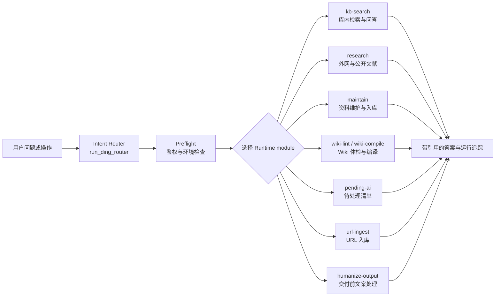
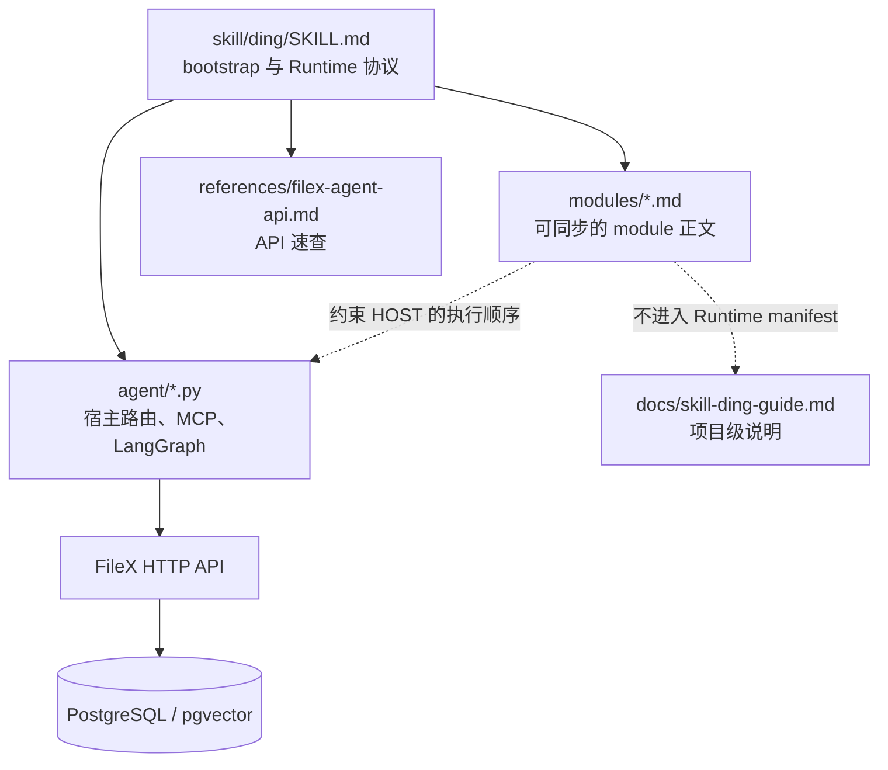
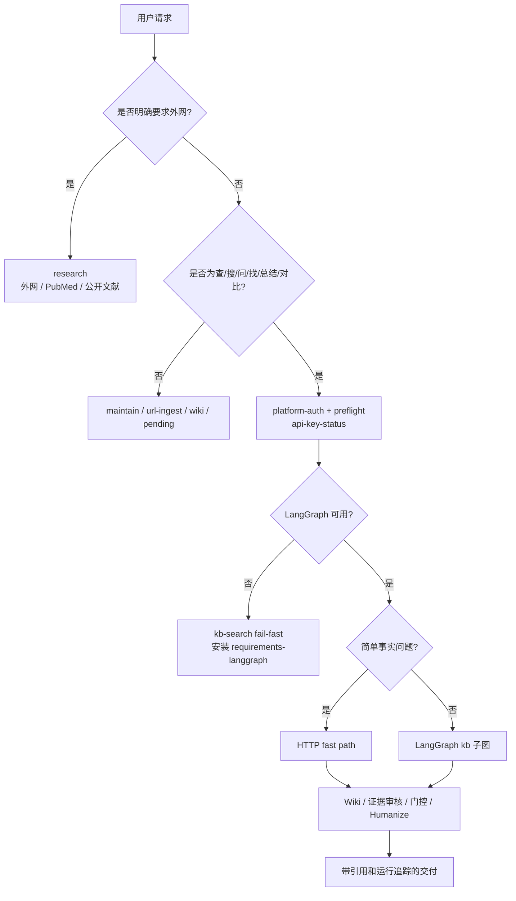
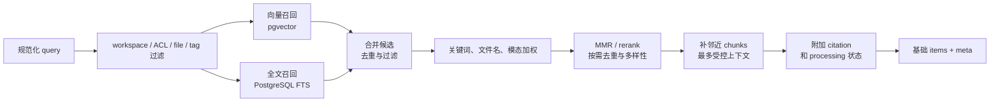
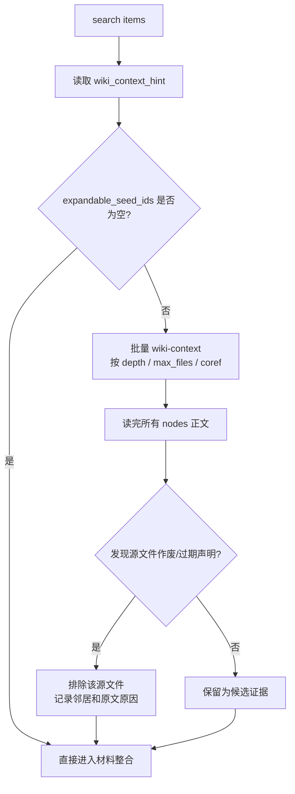
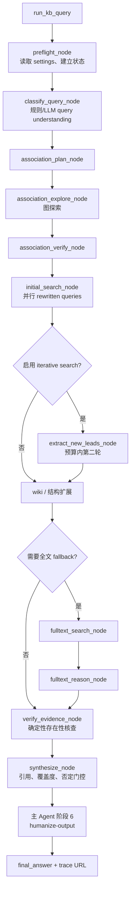
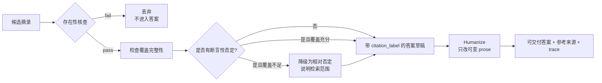

# Ding Skill 功能说明

> 本文是 `skill/ding` 的项目级功能说明，面向产品、开发、运维和 Agent 宿主维护者。
> 它解释“什么时候使用哪个模块、模块如何协作、`kb-search` 如何从问题走到可引用答案”。
> Runtime 的权威正文仍以 [`skill/ding/SKILL.md`](../skill/ding/SKILL.md) 和 [`skill/ding/modules/`](../skill/ding/modules/) 为准；本文用于建立全局心智模型，不替代模块内的强制规则。

## 1. Skill 是什么

`skill/ding` 是 FileX 的钉智能体技能包。它把一次用户请求拆成：

1. 识别用户意图；
2. 选择一个或多个 Runtime module；
3. 按 module 的前置条件、工具契约和证据规则执行；
4. 将结果整理为用户可读、可追溯的答案或操作结果。

Skill 运行在 Agent 宿主机上，FileX 服务端提供鉴权、知识库检索、Wiki 关系、文件内容和运行追踪等 HTTP API。`skill/ding/agent/` 是宿主参考实现，不是同步进 PostgreSQL 的 Runtime module 正文。



## 2. 模块地图

| module | 主要职责 | 典型触发 | 是否需要 FileX API Key |
| --- | --- | --- | --- |
| `platform-auth` | 配置宿主平台、读取 API Key 和 Origin | 首次安装或切换平台 | — |
| `preflight` | 检查工具、持久化、`api-key-status` 和运行前条件 | 进入需鉴权模块前 | 是 |
| `routing` | KB-First 路由规则和模块选择 | 每次需要判断“库内还是外网”时 | — |
| `kb-search` | 检索 FileX 已入库资料，展开关系并基于证据作答 | 查、搜、问、找、总结、对比 | 是 |
| `research` | 检索外网、公开资料、PubMed/NCBI | 用户明确要求外网或公开文献 | 否 |
| `maintain` | 上传、打标签、整理、归档、维护知识库 | 入库和存量维护 | 是 |
| `dual-path-synthesis` | 专员处理 + Agent 审核修订的双路合成 | 需要将资料整理为可检索笔记时 | 是 |
| `url-ingest` | URL → FileX 文件 → 提取 → 双路合成 | 用户要求把链接存入知识库 | 是 |
| `pending-ai` | 查找无 Markdown 或无标签的待处理资料 | 待处理、未整理、无标签 | 是 |
| `wiki-lint` | 检查 Wiki 互链、断链和命名问题 | Wiki 体检、断链、互链 | 是 |
| `wiki-compile` | 批量创建或更新概念页 | 补建主题、编译 Wiki | 是 |
| `humanize-output` | 在不改变证据和不可变引用片段的前提下改善文案 | 所有需要自然语言交付的路径 | 继承上游 |
| `troubleshooting` | 处理鉴权、连接、检索和入库故障 | 故障排查 | 视问题而定 |

模块正文与宿主代码的关系如下：



## 3. 总体路由规则

### 3.1 KB-First

当用户没有明确说“外网、联网、全网、PubMed、PMID、DOI、公开论文”等范围时，涉及 FileX、资料库、已上传文件或“之前那篇资料”的查询默认进入 `kb-search`。

- 库内有命中：只能使用本轮检索和取证得到的资料回答。
- 库内无命中：明确说明“资料库未找到相关内容”，询问是否扩展到外网；禁止静默改用 Web 或模型常识。
- 用户同时要求“先查库再查外网”：先完成 `kb-search`，再执行 `research`，并在答案中分块标识来源范围。
- 用户明确只要外网：可直接进入 `research`，不需要先执行 KB preflight。



### 3.2 统一入口

宿主已经通过 `api-key-status` 后，库内检索统一经以下入口之一：

```bash
cd skill/ding/agent
python3 filex_ding_router_cli.py "用户问题" --thread-id "session_id"
```

或调用 `run_ding_router(query, thread_id=...)`。生产路径不要自行拆成“调用 `/search` + 自己作答”；路由器负责选择 HTTP fast path 或 `run_kb_query`，并维护 router 与 KB 子图的会话追踪。

## 4. `kb-search` 详细说明

### 4.1 输入、边界和输出

`kb-search` 的目标不是“找一些相似文本”，而是从用户可访问的 FileX 资料中，产生一条可审计的证据链：

```text
问题 → 查询类型 → 受 ACL 约束的召回 → 关系/全文补全 → 证据审核 → 结论门控 → 引用答案
```

服务端主入口为 `POST /api/knowledge-base/search`，实现位于：

- 请求模型：[backend/schemas/kb.py](../backend/schemas/kb.py)
- API 路由：[backend/routers/knowledge_base.py](../backend/routers/knowledge_base.py)
- 基础检索：[backend/services/kb_search_service.py](../backend/services/kb_search_service.py)
- 排序：[backend/services/kb_search_rank.py](../backend/services/kb_search_rank.py)
- 查询扩展：[backend/services/kb_search_expansion.py](../backend/services/kb_search_expansion.py)
- Skill 宿主编排：[skill/ding/agent/filex_langgraph_kb_orchestrator.py](../skill/ding/agent/filex_langgraph_kb_orchestrator.py)

响应重点字段：

| 字段 | 用途 | 交付注意事项 |
| --- | --- | --- |
| `items` | 命中的 chunk、文件、摘要、上下文和来源信息 | 只能把通过证据审核的内容用于结论 |
| `embedding_model` | 本轮向量检索使用的模型 | 主要用于调试和追踪 |
| `top_k` | 实际结果上限 | 不向用户暴露内部排序细节 |
| `fetched_at` | 本轮检索快照时间 | 每轮重新检索，不能用旧会话结果代替 |
| `agent_notice` | Agent 必读提示 | 可能包含 Wiki 展开和引用要求 |
| `wiki_context_hint` | `seed_file_ids`、可展开 seed、深度和并行建议 | 只展开 `expandable_seed_ids` |
| `wiki_context` | 请求开启 Wiki 展开时的批量节点结果 | 需读完节点正文再做有效性判断 |
| `meta` | 检索策略、缓存、扩展、debug funnel 等元数据 | 用于审计和定位降级，不作为用户证据 |
| `agent_trace_view_url` | 本次 Agent 运行伴生页 | 主 Agent 应保留并交付该链接 |

### 4.2 查询类型与默认参数

查询类型由规则和必要时的 LLM query-understanding 共同决定。基础参数通常是 `top_k=8`、`group_by_file=true`、`citation_format=markdown`、`context_chunks=2`，随后按问题类型细化：

| 类型 | 识别场景 | 关键策略 |
| --- | --- | --- |
| `fact` | 单点事实 | `context_chunks=1`，尽快返回直接证据 |
| `procedure` | “如何、步骤、流程” | `context_chunks=2` |
| `cjk_doc` | 发票、合同、报告等文档型问句 | 文件名加权 + 查询扩展 |
| `structured_field` | 金额、日期、费用、合计 | `context_chunks=3`，提高字段上下文覆盖 |
| `full_summary` | 全文、要点、清单 | `top_k=12` |
| `topic_wiki` | 主题、关联、对比、邻居 | Wiki 深度 2 + 共引展开 |
| `struct_relation` | A 与 B 的关系、引用链、出链 | Wiki path/explain，必要时降级 search |
| `tag_topic` | 标签关联、共现、相邻标签 | Wiki 深度 1 + `expand_tag_cooc` |
| `tag_archive` | 某标签下的资料 | 默认 `tag_combine=filter`；需要集合并集时显式使用 union |
| `exact_term` | 短中文精确词 | 关闭查询扩展，启用 hybrid |
| `figure_vlm` | 图、流程图、截图、曲线 | 模态意图识别和 modality boost；需要 VLM 时再读图 |

### 4.3 基础召回和排序

服务端的 `search_kb` 大致按下列顺序工作：



具体要点：

- ACL 过滤先于结果交付；跨 workspace 只有在用户权限和系统开关都允许时才启用。
- hybrid 开启时组合向量和全文召回；查询扩展会生成多个检索词并按 RRF 合并排名。
- `min_score` 过滤低质量候选；关键词、文件名和图/表/公式意图可增加分数。
- `group_by_file=true` 时先聚合文件，再做文件级结果控制；否则保留 chunk 级结果并按 MMR 约束重复内容。
- 命中文件仍在 extract/index/post 处理时，会返回 processing placeholder；它不能被当成正式内容证据。
- query cache 只适用于结果稳定的普通检索；开启 Wiki、标签共现、图扩展、实体扩展或跨 workspace 时应跳过缓存。

### 4.4 检索扩展层

基础 search 返回后，路由器根据问题类型和请求开关继续扩展。扩展不是无条件全部开启，而是由 profile、开关和 ACL 共同决定：

| 扩展 | 解决的问题 | 主要输出 |
| --- | --- | --- |
| `expand_wiki_links` | 找到主题页、出链邻居和共引关系 | `wiki_context.nodes`、`wiki_context_hint` |
| `expand_wiki_graph` | 以 chunk 级关联补充召回 | `source_kind=wiki_graph_expand` |
| `expand_tag_cooc` | 标签之间的共现主题 | 标签扩展结果和 meta |
| `expand_doc_entities` | 文档实体关系补充 | 实体邻居和关系 meta |
| `expand_sag_events` | “经过哪些环节、如何影响”的多跳事件链 | SAG 事件节点、路径和 trace |
| `raptor_expand` | 使用层级摘要向下钻取原文 | 摘要命中与原 chunk |
| multi-representation | 用事件摘要、实体列表、RAPTOR 摘要等表征补召回 | `source_kind=multi_repr:*` |
| iterative search | 从首轮 chunk 提取新实体，再做一轮检索 | 新查询、预算和截断状态 |
| association / fulltext fallback | 关系图不足以回答时，读取完整 Markdown | `full_md` 证据和覆盖回执 |

扩展后的结果要再次去重、按文件聚合、限制 top-k，并将扩展元数据写回 `meta`。扩展结果不能绕过后续证据审核。

### 4.5 Wiki 展开和有效性评估

命中结果中的 `wiki_context_hint.expandable_seed_ids` 是唯一允许展开的 seed 集合。推荐路径是在同一次 search 中传 `expand_wiki_links=true`；需要主题/共引时再传 `expand_wiki_coref=true`、`wiki_context_depth=2`。

Wiki 节点必须读到正文末尾。若邻居文档声明某个源文件“作废、过期、已被替代、请勿引用或不再维护”，该源文件必须从整合和证据审核中排除，并保留排除原因。



### 4.6 LangGraph 复杂路径

简单事实问题可由 router 走 HTTP fast path；复杂问题、不确定问题或需要关系/全文/多轮检索时走 `run_kb_query`。Graph 不改变“必须有证据才能作答”的边界，只把检索和闸门编排成可恢复的状态机。



### 4.7 证据闸门和答案规则

`kb-search` 的关键不是“召回越多越好”，而是“进入答案的内容必须可核对”。完整交付至少包含以下阶段：

1. 检索并读 `fetched_at`、`agent_notice`、`wiki_context_hint`。
2. 按补全判定读取必要的邻近 chunk、Wiki 节点或 Markdown 全文。
3. Wiki 展开后完成源文件有效性评估。
4. 对每一条候选证据运行 `filex_evidence_verify` 或使用 Graph 内置 `verify_evidence` 节点。
5. 若回答含“没有、不存在、未找到”等断言性否定，检查全文、实体覆盖或检索预算是否满足否定结论门控；否则改写为“未在已检索范围内发现……”。
6. 在用户答案正文或“参考来源”中披露 `citation_label`；不披露 `file_id`、`chunk_id`、`score` 或内部 curl。
7. 最后执行 `humanize-output`。引用、verified evidence bullet、闸门句等 immutable span 必须 exact-match 保留。



### 4.8 无命中、部分失败和处理中资料

| 情况 | 正确行为 |
| --- | --- |
| 无命中且无可展开 seed | 说明资料库未找到；不静默外搜 |
| Wiki 某个 seed 展开失败 | 使用成功节点和 search/md 摘录，明确未展开的文件名 |
| `processing_placeholder` | 说明资料仍在 extract/index；不得作为正式证据 |
| `final_md_post_pending` | 基础 chunk 可引用，但提示高级后处理尚未完成 |
| `final_md_post_failed` | 基础 chunk 可引用，提示高级后处理失败 |
| ACL 上下文缺失 | 阻塞证据链，不能用无权限上下文补答 |
| LangGraph 未安装 | fail-fast，提示安装 `requirements-langgraph.example.txt` |
| 否定结论覆盖不足 | 输出相对否定文案，不输出绝对否定 |

## 5. 其他核心流程

### 5.1 入库与维护

`maintain` 负责文件、目录、标签和存量资料维护；需要整理成知识笔记时，和 `dual-path-synthesis` 配合，避免把原始上传内容直接当成最终笔记。URL 入库还要加上 `url-ingest`，形成 URL 探测、上传、提取、合成、finalize 的闭环。


### 5.2 Wiki 管理

- `wiki-lint`：发现断链、命名和互链问题。
- `wiki-compile`：从待编译 slug 创建或更新概念页。
- `kb-search`：消费已经存在的 Wiki 关系，不能把一次问答隐式变成批量 Wiki 编译。

### 5.3 外网研究

`research` 仅负责用户明确要求的外部资料。它与 `kb-search` 的结果必须分块呈现，不能把外网结果包装成“资料库证据”。若用户要求“库内查一遍再去外网”，顺序固定为 `kb-search → research`。

## 6. 配置、观测和维护者入口

### 6.1 常用配置族

KB 检索相关设置由服务端统一管理，常见配置族包括：

- `kb_search_hybrid_enabled`
- `kb_search_min_score`
- `kb_search_default_top_k`
- `kb_search_boost_keyword_bonus`
- `kb_search_filename_boost`
- `kb_search_modality_boost` 与 `kb_search_modality_boost_enabled`
- `kb_search_mmr_lambda`
- `kb_search_tag_cooc_enabled` 与最小边数
- `kb_search_cache_enabled`、相似度阈值、TTL、每用户上限

修改这些值时要以服务端解析、边界校验和实际运行日志为准；只改配置文件而没有真实 search smoke 或容器日志，不能证明配置生效。

### 6.2 运行追踪

库内问句应保留 `thread_id`。router、并行 search、Wiki context、Graph 节点和 finalize 追加到同一 Agent run；完成后交付 `agent_trace_view_url`。追踪用于回答“走了哪条路径、命中了哪些扩展、是否发生降级”，不替代用户可见的来源引用。

### 6.3 维护者检查清单

- 修改 Runtime module 正文或 API 说明后，按 [`skill/ding/README.md`](../skill/ding/README.md) 执行版本和发布检查。
- 只改 `agent/*.py` 且不影响 zip / update 安装行为时，通常无需 bump Skill 版本。
- 修改 `kb-search` 规则时，同时核对 `modules/routing.md`、`modules/kb-search.md`、`agent/filex_langgraph_common.py`、服务端 retrieval hints 和对应测试。
- 任何排序、ACL、缓存、Wiki 扩展或证据规则变化，都要补充 targeted test，并至少验证一次真实 HTTP/CLI smoke。

## 7. 进一步阅读

- [Skill bootstrap 与 Runtime 协议](../skill/ding/SKILL.md)
- [路由规则](../skill/ding/modules/routing.md)
- [kb-search Runtime 正文](../skill/ding/modules/kb-search.md)
- [平台鉴权](../skill/ding/modules/platform-auth.md)
- [运行前检查](../skill/ding/modules/preflight.md)
- [Humanize 输出规范](../skill/ding/modules/humanize-output.md)
- [FileX Agent API](../skill/ding/references/filex-agent-api.md)
- [Skill 维护者说明](../skill/ding/README.md)
