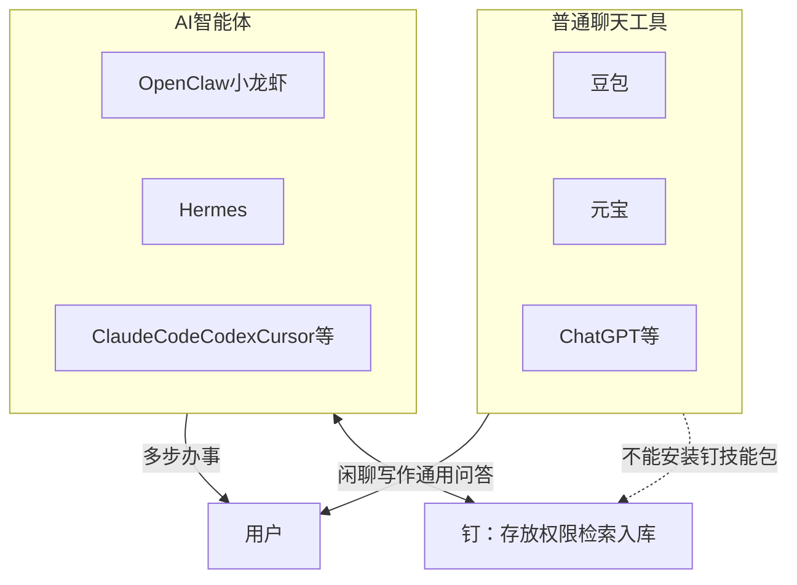
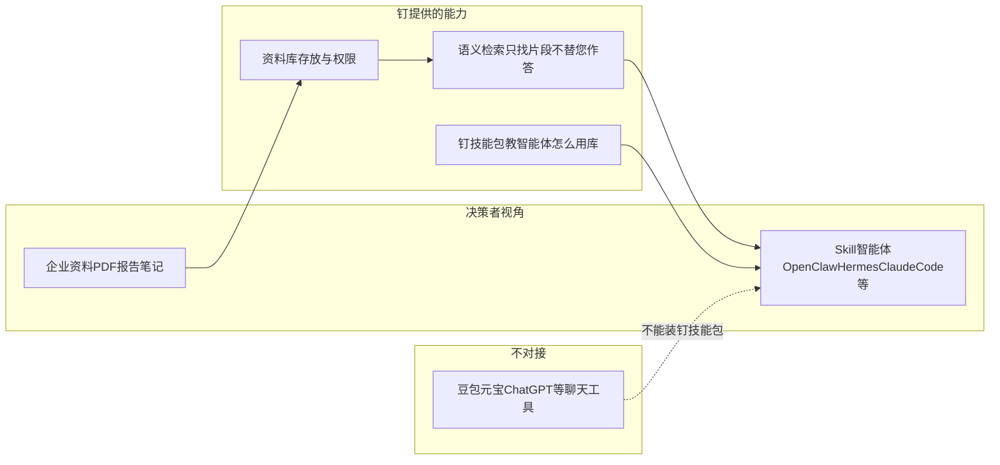
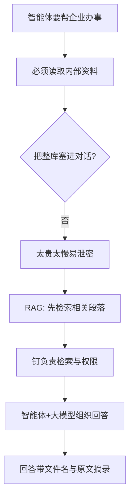
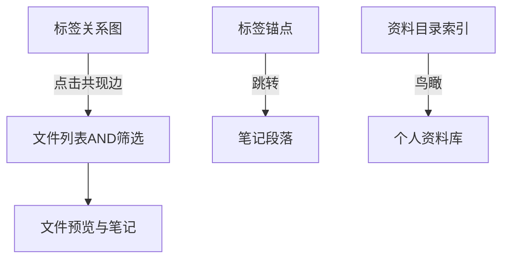

# 钉 — 项目介绍（完整版 · PPT 内容稿）

> **用途**：生成完整版演示文稿的内容底稿。  
> **受众**：业务负责人、信息化部门、采购评估者等非技术决策者。  
> **建议篇幅**：28–38 分钟演讲，约 40–50 页幻灯片，含 FAQ 与落地建议。

---

## 目录（建议幻灯片结构）

0. **宣讲**：**ding 是什么？**（钉 / 叮）+ Karpathy LLM-Wiki 与 **资料存档 → 资料库 → 决策库**  
1. 一句话价值  
2. 大模型、智能体与钉的关系  
3. **普通聊天工具 vs AI 智能体**（豆包/元宝/ChatGPT 与 Agent 的区别；钉对接谁）  
4. 为什么智能体需要 RAG（需要钉）  
5. RAG 两年演进与普通 RAG vs 钉  
6. 钉的亮点（含 **多格式提取**、**网上资料一条龙入库**）  
7. 典型使用场景  
8. 落地建议（决策者版）  
9. 常见问题 FAQ  
10. 三句话总结与下一步  

---

## 第 1 页 · 宣讲：ding 是什么？

### 1. ding 是什么？

**1.1 「钉」** — 代表给 AI 智能体提供资料的 **准确内容**。

**1.2 「叮」** — 代表知识从 **积累到融合** 后的 **顿悟感**。

---

**理论背景 · Andrej Karpathy**

**Andrej Karpathy** 是全球顶尖的人工智能与深度学习专家，曾先后在 **OpenAI**、**特斯拉（Tesla）** 等顶尖科技企业担任核心要职。他于 **2026 年 5 月** 正式加入 AI 独角兽企业 **Anthropic** 的预训练团队，专注于加速预训练研究与 **AI 自我进化**。

**LLM-Wiki 方法论**（`llm-wiki.md`，GitHub Gist）来源即 Karpathy。

**它回答的问题**：有了大模型和智能体之后，**个人/组织的知识该怎么管**，才不只是「聊天时临时搜一下」？

**三个核心主张**（决策者版）：

1. **摄入时编译，而非查询时现搜** — 资料进来时就让智能体整理成 **可复用的结构化知识**，而不是每次提问从零检索碎片  
2. **三层分工** — **原文保留**（真相之源）→ **Wiki/笔记层**（智能体维护的摘要、关联、更新）→ **规则层**（Schema，规定怎么入库、怎么查、怎么维护）  
3. **智能体是管理员** — 负责 Ingest（摄入）、Query（带证据查询）、Synthesize（综合）、Lint（体检），知识 **越用越厚**

**钉与这一理论的关系**：

> **钉 = Karpathy LLM-Wiki 理论的践行平台** — 不是概念 PPT，而是可部署、可对接智能体、可日常运营的产品与技能包。

---

## 第 2 页 · 三级演进：资料存档 → 资料库 → 决策库

| 阶段 | 一句话 | 若停在这一层会怎样 | 钉的关键能力 |
|------|--------|-------------------|--------------|
| **资料存档** | 文件 **收好、找得到** | 像网盘：有文件，但不知道里面写了什么 | 上传、预览、文件夹、**资料目录索引** |
| **资料库** | 内容 **懂、连、搜、进化** | 有存档，但问不清楚、关联不起来 | 自动笔记、打标签、语义检索、**标签关系图**、网上资料一条龙入库 |
| **决策库** | 知识 **能支撑判断** | 不敢把 AI 回答用于合规、研发、管理决策 | 智能体 **只检索不代答**；回答必须 **文件名 + 原文摘录**，证据可核对 |

**演进逻辑**：同一份资料在钉上 **逐步升维** — 不是买三个系统，而是 **一个平台走完三段路**。

---

## 第 3 页 · 钉如何践行 LLM-Wiki（对照表）

| Karpathy LLM-Wiki 概念 | 钉里的落地 |
|------------------------|------------|
| 原始资料层（raw，只读保留） | 上传的 **Office / PDF / 图片** 等原文文件（多格式） |
| Wiki 知识层（智能体维护） | 资料 **Markdown 笔记**、标签、**资料目录索引** AUTO 区 |
| Schema 规则层 | **钉技能包**（`/ding`）：规范入库、检索、打标、带出处作答 |
| Ingest（摄入编译） | 网上资料 **查找/下载 → 入库 → 提取笔记 → 打标 → 索引** |
| Query（查询） | **语义检索**，返回片段；智能体须 **每轮重新查库**，禁止凭记忆胡编 |
| 交叉引用 | **标签关系图**、笔记内锚点、目录索引 |
| 知识复利 | **可进化**：新资料与整理动作自动更新索引与目录 |

**因此**：钉的产品路径，就是把 Karpathy 的「个人 Wiki 范式」做成 **企业可部署、智能体可执行** 的 **资料存档 → 资料库 → 决策库** 演进平台。

---

## 第 4 页 · 封面

**钉** — Karpathy LLM-Wiki 理论的践行平台

**资料存档 → 资料库 → 决策库** · 让智能体安全、可追溯地使用您的内部资料

---

## 第 5 页 · 一句话价值

**钉** 是让 AI 智能体安全、可追溯地使用「本单位资料」的资料库与检索服务。

| 钉 **是** | 钉 **不是** |
|-----------|-------------|
| 内部资料的存放与权限管理 | 豆包/元宝式 **聊天工具**（**不能** 装钉技能包） |
| 按语义精准找原文片段 | 在平台里直接 Chat 出答案 |
| 从网上获取资料并 **完整整理入库** | 人工逐篇下载、上传、整理 |
| 个人资料库 + 可进化索引 + 智能体技能包 | 一次性导入、越用越乱的文件堆 |

**钉对接谁？** 支持 **标准 Skill** 的智能体 — **OpenClaw（小龙虾）、Hermes、Claude Code、Codex、Cursor** 及国内 **Skill 兼容「龙虾」变体** 等，安装钉技能包即可使用。安装后须在智能体宿主配置 `FILEX_ORIGIN` 与 `fb_` API Key（Hermes：`~/.hermes/.env`），详见站点「安装 agent 技能」说明。

**钉不对接谁？** **豆包、元宝、ChatGPT 聊天版** 等 — 它们是一问一答的聊天产品，**不支持** 安装钉技能包。

对外统一称 **「钉」**；智能体中可用 `/ding` 触发相关技能。底层平台为 FileX，使用者日常只需知道「钉」。

---

## 第 6 页 · 普通聊天工具 vs AI 智能体（先分清两类产品）

很多人把 **豆包、元宝、ChatGPT** 和 **OpenClaw、Hermes、Claude Code** 都叫作「AI」—— 其实是 **两种不同产品**。评估或采购「钉」之前，建议先用这一页把品类讲清楚。

### 普通聊天工具（Chat）

| 项目 | 说明 |
|------|------|
| **代表** | 豆包、元宝、ChatGPT、通义千问等 |
| **像什么** | 在微信里和顾问 **聊天** — 问一句，答一句 |
| **擅长** | 日常问答、写作灵感、翻译、通用闲聊 |
| **与钉** | **不能** 安装钉技能包；**不是** 钉的对接入口 |

**常见误解**：「豆包里也能上传文档啊？」—— 那是 **个人、轻量、临时** 的文档问答，无法替代钉所支持的 **从网上获取 → 入库 → 提取笔记 → 打标 → 索引 → 带出处检索** 全流程，且 **装不了钉技能包**。

### AI 智能体（Agent）

| 项目 | 说明 |
|------|------|
| **代表** | OpenClaw（小龙虾）、Hermes、Claude Code、Codex、Cursor、国内 Skill 兼容「龙虾」变体 |
| **像什么** | 给助理 **派活** — 多步执行，可下载、上传、检索、写报告 |
| **擅长** | 文献批量入库、内规带出处查询、网上资料一条龙整理进库 |
| **与钉** | 安装 **钉技能包** 后，规范查库、入库、**必须带文件名与原文摘录** |

### 核心对比（决策者版）

| 维度 | 豆包 / 元宝 / ChatGPT 等 | AI 智能体 |
|------|-------------------------|-----------|
| 本质 | **聊天产品** | **办事型 AI**（Agent） |
| 交互 | 一问一答 | 多步骤任务流 |
| 工具能力 | 弱（多在对话框内完成） | 强（文件、API、技能包） |
| 内部资料库 | 临时上传、难长期运营 | 通过 **钉** 长期沉淀、可进化 |
| 回答可追溯 | 难核对出自哪份文件哪一段 | 钉返回 **原文片段 + 文件名** |
| 能否对接钉 | **否** | **是**（须支持标准 Skill） |

**一句话记牢**：**Chat 陪聊，Agent 办事；钉只服务 Agent，不对接 Chat。**

---

## 第 7 页 · 钉支持的 Skill 智能体（清单）

| 类型 | 代表 |
|------|------|
| 国际/开源类 | **OpenClaw**（小龙虾）、**Hermes**、**Claude Code**、**Codex**、**Cursor** |
| 国内变体 | 各大厂商 **Skill 兼容「龙虾」类智能体** |

对外统一称 **「钉」**；智能体中可用 `/ding` 触发相关技能。底层平台为 FileX，使用者日常只需知道「钉」。

---

## 第 8 页 · 钉 — 四类能力

1. **资料库** — 支持 **Office 新旧版**、**可编排 / 图片版 PDF**、**图片** 等多格式入库与自动提取笔记；每人独立个人资料库；二级文件夹归档；管理员管理账号  

**多格式资料处理**（入库后自动提取正文，再进入检索，不依赖大模型「猜内容」）：

| 类别 | 说明 | 典型扩展名 |
|------|------|------------|
| **Office（新旧版本）** | 新版与旧版办公文档均可；旧版经转换后提取 | .doc / .docx、.xls / .xlsx、.ppt / .pptx |
| **PDF · 可编排** | 电子版、可选中复制文字的 PDF | .pdf |
| **PDF · 图片版** | 扫描件、拍照 PDF，自动 **OCR** | .pdf |
| **图片** | 截图、照片、扫描图等 | .jpg、.png、.gif、.bmp、.webp 等 |

2. **语义检索** — 返回最相关 **原文片段** 及文件名；**不在钉内 Chat 出最终答案**  
3. **网上资料自动整理入库** — 智能体按主题或链接从网上获取公开资料，自动走完下载至索引的全流程  
4. **钉技能包** — 教智能体何时查库、如何入库、如何必须带出处  

---

## 第 9 页 · 三者关系图

**说明**：钉只对接 **支持标准 Skill 的智能体**；豆包、元宝等聊天工具不在主链路中。

---

## 第 10 页 · RAG 白话解释

**RAG**（检索增强生成）：

> 不要指望大模型「背下」整库。先 **检索** 最相关段落（钉做），再 **生成** 组织好的回答（您选的大模型做）。

钉 **只做检索、不做 Chat 生成**：

- 答案必须能回到原文  
- 大模型供应商可更换  
- 降低瞎编内部制度的风险  

---

## 第 11 页 · 误解澄清（与第 6 页呼应）

> 品类对比见 **第 6 页**。本节仅列常见口头误解。

**「我们已经在用豆包上传文档了，为什么还要钉？」**

豆包是 **聊天工具**，**不能** 安装钉技能包 — **不是** 钉的对接方式。其上传文档功能适合 **个人、轻量、临时** 问答。

要用钉，须换用（或另开）**支持 Skill 的智能体**，再安装钉技能包。钉面向 **长期、规范地使用内部资料**：每人独立资料库、待处理清单、智能体批量入库、语义检索 — **可运营的个人知识底座**。

---

## 第 13 页 · 误解澄清（2）

**「上了钉就要换掉 ChatGPT / 豆包。」**

**误解。** 钉 **不替您 Chat**，也 **不对接** 豆包、元宝等聊天工具。内部资料须通过 **Skill 智能体 + 钉** 查库、入库；智能体可选用其内置大模型组织语言，**证据来自钉**。

**「智能体 = 更高级的 Chat。」**

智能体价值在 **执行** — 下载 20 篇文献、入库、打标签、写报告。豆包/元宝等 Chat **不能** 稳定跑 **多步、可审计** 的钉流程。

---

## 第 14 页 · 为什么 Skill 智能体需要钉

**OpenClaw、Hermes、Claude Code、Codex** 等的目标是 **完成工作流**，不是陪聊。

必须解决：**内部资料从哪来、怎么查、怎么证明没瞎编** — 这只能通过 **安装钉技能包** 的智能体 + 钉 实现。

---

## 第 15 页 · 逻辑链

1. 内部资料不可替代  
2. 整库塞进上下文不现实  
3. RAG：先检索、再生成；钉 **只检索不代答**  

---

## 第 16 页 · 没有钉时会怎样

| 问题 | 后果 |
|------|------|
| 碰不到内部文件 | 泛泛而谈或靠公开信息 |
| 凭模型猜测 | 合规、质量、研发 **不可接受** |
| 无法批量维护库 | 资料散落，越用越乱 |
| 无法证明出处 | 审计、培训 **缺乏依据** |

---

## 第 17 页 · RAG 演进时间线

| 阶段 | 时间 | 典型形态 | 适配对象 |
|------|------|----------|----------|
| 传统 RAG | 2023–2024 | 上传 PDF → 检索 → **聊天框出答案** | LLM 聊天模式 |
| 增强 RAG | 2024 | 混合检索、重排序 | 仍偏 Chat |
| 智能体式 RAG | 2024–2025 | 多轮检索、工具调用 | **AI Agent** |
| **钉** | 2025+ | 只检索、技能包驱动 | OpenClaw / Hermes / Claude Code / Codex / Cursor 等 **Skill 智能体** |

---

## 第 18 页 · 普通 RAG vs 钉（详细）

| 维度 | 传统 RAG | 钉 |
|------|----------|-----|
| 设计对象 | 聊天框问文档 | 智能体查库、入库 |
| 流程 | IT 自定义 | **钉技能包** 约定顺序 |
| 答案生成 | 平台内 **直接 Chat** | **钉不 Chat**；证据给智能体 |
| 权限 | 谁上传谁看 | 每人独立资料库 + 管理员管账号 |
| 资料获取 | 常需人工下载再上传 | **智能体从网上获取并自动整理入库** |
| 资料索引 | 常索引 PDF | 优先 **Markdown 笔记** |
| 知识生命周期 | 一次性导入 | **可进化** |
| 知识关联 | 弱 | 标签关系图、锚点、目录索引 |
| 待办可见性 | 少见 | **待 AI 处理清单** |
| 大模型绑定 | 常绑 Chat 产品 | **Chat 模型可换** |

**一句话**：传统 RAG 是「给 Chat 加文档」；钉是「给 Agent 加档案室与检索规范」。

---

## 第 19 页 · 亮点一：知识可进化（概览）

传统资料库 = 一次性导入，越用越乱。

钉 = **持续运营**：新进资料自动上架、贴标签、进索引。

---

## 第 20 页 · 知识可进化（环节表）

| 环节 | 发生什么 | 对决策者的意义 |
|------|----------|----------------|
| 上传文件 | 进入本人的个人资料库 | 资料有「家」 |
| 自动提取笔记 | **Office 新旧版**、**可编排/图片版 PDF**、**图片** 等 → Markdown | 检索更准；无需人工先统一格式 |
| 自动索引 | 笔记进入语义检索 | 新资料 **自动可搜** |
| 目录同步 | 总目录随库更新 | **鸟瞰全库** |
| 智能体打标/补笔记 | 标签与笔记持续完善 | 库 **越用越懂业务** |
| 待 AI 处理清单 | 无标签、无笔记的文件 | 运营可见缺口 |

---

## 第 21 页 · 亮点二：网上资料，一条龙入库（概览）

**钉的另一大特色**：不只管理「已经在你电脑里的文件」，还能让智能体 **从网上把资料完整整理进资料库**。

您只需给出 **检索主题** 或 **公开资料链接**（如外网公开页面、PubMed 文献、PDF 下载地址），智能体在钉技能包规范下自动串联：

**查找/下载 → 入库 → 提取可读笔记 → 打标签 → 建立检索索引**

网上零散信息变成库内 **可搜、可引用、可核对出处** 的正式知识，无需人工逐篇保存、转换、上传。

**典型入口**

- **外网文献发现** — 优先 Web 搜索；生物医学可用 PubMed 等，再批量入库整理  
- **公开 PDF / 资料链接** — 给链接即下载入库  
- **与库内检索配合** — 先查已有资料，再决定是否从外网补充入库  

---

## 第 22 页 · 网上资料入库：完整流程

| 步骤 | 发生什么 | 您需要做什么 |
|------|----------|--------------|
| 1. 查找/下载 | 智能体用 Web 搜索或 PubMed 按主题发现资料，或按链接下载公开 PDF | 给出主题、链接或「帮我找并入库」 |
| 2. 入库 | 原文进入个人资料库，可指定文件夹 | 可选说明放哪个文件夹 |
| 3. 提取笔记 | **Office 新旧版**、**可编排/图片版 PDF**、**图片** 等自动转为可读笔记 | 一般无需手工、无需先统一格式 |
| 4. 打标签 | 按主题自动归类 | 可事后调整 |
| 5. 建立索引 | 笔记进入语义检索 | 等待就绪后即可检索引用 |
| 6. 待处理清单 | 尚未打标、无笔记的文件可继续批量整理 | 派智能体「扫尾」 |

**与传统做法对比**：以前 = 浏览器下载 → 手动改名 → 手动上传 → 手动整理；现在 = **一条指令，全流程自动跑通**。

---

## 第 23 页 · 亮点三：知识节点联通

**1. 标签关系图** — 节点=标签，连线=共现；发现主题团块与孤岛

**2. 笔记内锚点** — 从标签跳到段落，核对引用

**3. 资料目录索引** — 汇总资料库内文件元信息，快速定位

通过 **标签共现、锚点、目录索引** 实现联通，服务于找得到、对得上原文。

---

## 第 24 页 · 知识联通关系图

---

## 第 25 页 · 亮点四：安全与权限

- 每人 **独立资料库**，资料按用户隔离  
- 管理员创建账号、启停用户  
- 单文件 **分享链接** 可控外发  
- 智能体专用密钥，停用即失效，可审计  

---

## 第 26 页 · 亮点五：检索与生成解耦

钉 **不在服务端调用 Chat 大模型** 生成最终答案：

- 不必把内部资料全文发给公有云 Chat 厂商  
- 检索索引可在 **本地** 完成  
- **Skill 智能体** 从钉取证据，再用其配置的大模型组织表述 — **豆包、元宝等聊天工具不能走这条链路**

---

## 第 27 页 · 场景 1：网上文献一条龙入库

**背景**：研发人员经常从外网或 PubMed 等渠道发现新论文，过去要手动下载、保存、上传。

**流程**：

1. 用户：「帮我把关于 XX 靶点的近五年相关文献入库并打标。」  
2. 智能体 Web/PubMed 检索 → 下载 PDF → **自动入库、提取笔记、打标签、建索引**  
3. 后续提问：「库里关于 XX 的临床前数据有哪些？」→ 钉检索 → 带 **文件名与摘录** 写综述  

**价值**：从「网上看到」到「库里可搜」**一次跑通**；减少重复下载与重复阅读。

---

## 第 28 页 · 场景 2：合规与质量

内规、SOP、检验标准入库 → 语义检索 → 回答引用 **具体文件与段落** → 审计与培训可复核

---

## 第 29 页 · 场景 3：资料库持续沉淀

各人维护个人资料库 → 智能体持续打标、补笔记 → 资料目录与标签关系图观察知识结构 → 零散文件变成 **可检索、可跳转** 的网络

---

## 第 30 页 · 场景 4：智能体批量扫尾

待 AI 处理清单 → 智能体批量补笔记、打标签 → 检索质量台阶式提升

---

## 第 31 页 · 场景 5：选对入口（Skill 智能体，非聊天工具）

日常闲聊、写作灵感 → 仍可用 **豆包、元宝** 等（与钉 **无关**）  

内部制度、实验数据、文献入库与带出处检索 → **必须用支持 Skill 的智能体 + 钉**（**不能** 指望豆包/元宝装钉技能包）

---

## 第 32 页 · 落地建议：先想清楚

| 问题 | 建议 |
|------|------|
| 主要用户是人还是智能体？ | 要用钉 → **须部署支持 Skill 的智能体**（非豆包/元宝） |
| 资料含敏感/合规内容？ | 更需要 **只检索、可核对原文** |
| 预计使用人数？ | 提前规划管理员开通账号与智能体密钥 |

---

## 第 33 页 · 落地建议：部署形态（概念）

- 钉服务：企业服务器或私有云部署  
- 数据与索引：企业可控环境  
- 检索索引：可本地化，不依赖公有云 Chat  
- Chat 大模型：由 **Skill 智能体** 在其运行环境中调用（**不是** 豆包/元宝聊天框）

---

## 第 34 页 · 落地建议：组织三步

1. **试点** — 选一类资料（如外网文献或内部 SOP），跑通 **网上入库或本地上传** → 检索 → 带出处回答  
2. **装钉技能包** — 规范「库内必查、必引原文」  
3. **扩大试点** — 增加用户与资料类型，用标签关系图观察结构是否合理  

---

## 第 35 页 · 成功指标

- 从外网发现到入库可搜的 **平均步骤数** 下降（目标：一条智能体指令）  
- 内部问题 **带文件名回答** 的比例上升  
- 待 AI 处理清单 **数量下降**  
- 新人/跨组 **重复劳动** 减少  
- 智能体任务 **可审计**  

---

## 第 36 页 · FAQ（1–3）

**钉会取代豆包/元宝吗？** — **品类不同。** 豆包、元宝是聊天工具，**不能对接钉**。内部资料管理须用 **Skill 智能体 + 钉**；日常聊天仍可用豆包/元宝，但与钉无关。

**没有程序员能用吗？** — Web 界面业务可用；**须** 在支持 Skill 的智能体中配置钉技能包与 API 密钥（豆包/元宝 **不能** 装技能包）。

**数据存在哪？会上传 Chat 厂商吗？** — 在您部署的服务器；钉不在服务端 Chat；证据片段是否发给智能体所用大模型，由治理策略决定。

---

## 第 37 页 · FAQ（4–6）

**什么是「只检索不 Chat」？** — 检索与生成解耦；先取证再表述；易审计、易换模型。

**钉 vs 网盘 + 豆包上传？** — 网盘=存；豆包上传=临时问（**不能** 装钉）；钉= **Skill 智能体** 驱动 **从网上获取到入库索引的全流程** + 知识运营。

**钉技能包 / `/ding` 是什么？** — 教 **Skill 智能体** 查库入库的操作规范；`/ding` 为触发命令，IT 在 OpenClaw、Hermes、Claude Code 等环境中配置。

---

## 第 38 页 · FAQ（7–11）

**OpenClaw / Hermes / Claude Code 等必须选一家吗？** — 不必；凡 **支持标准 Skill** 的智能体均可安装钉技能包对接。

**豆包、元宝能装钉吗？** — **不能。** 它们是聊天工具，不是 Skill 智能体，**不是** 钉的对接对象。

**「可进化」会改乱资料吗？** — 只更新索引与目录；正文改动手动或按权限进行。

**标签关系图是知识图谱吗？** — 基于 **标签共现**，非通用实体图谱；对文献与 SOP 管理足够实用。

**如何开始试点？** — 部署 → 试一条「网上文献入库」或上传典型资料 → 装技能包 → 3–5 个带出处问题验收 → 扩推广。

**能从任意网站爬取吗？** — 智能体按钉技能包规范，支持 **Web 外网检索**、**PubMed 生物医学检索**、**公开 PDF/资料链接下载入库** 等流程；具体以您部署环境与合规要求为准，**不是**无限制抓取任意网站。

---

## 第 39 页 · 三句话总结

1. **钉践行 Karpathy LLM-Wiki 理论**，推动 **资料存档 → 资料库 → 决策库** 演进  
2. **须用支持标准 Skill 的智能体**（OpenClaw、Hermes、Claude Code、Codex、Cursor、国内龙虾变体等）+ 钉；**豆包、元宝等聊天工具不能对接钉**  
3. **相比传统 RAG**，钉为智能体而生：只检索不代答、知识可进化、节点可联通  

---

## 第 40 页 · 建议下一步

| 角色 | 行动 |
|------|------|
| 业务负责人 | 选定试点（**网上文献入库** 或内部资料），明确带出处验收问题 |
| 信息化 | 确认部署、账号与智能体密钥策略 |
| 智能体用户 | 在 **Skill 智能体**（非豆包/元宝）中装钉技能包，跑通 **网上入库或本地上传** → 检索 → 带引用 |
| 全员 | 区分 **聊天工具**（豆包/元宝，与钉无关）与 **内部知识必用 Skill 智能体 + 钉** |
