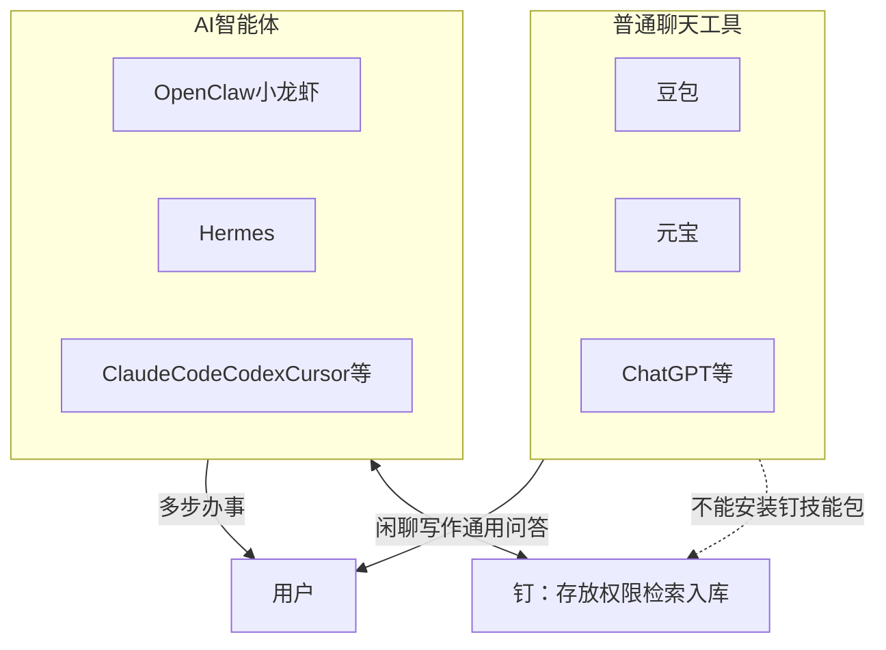
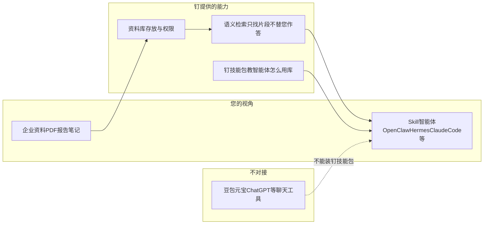

# 钉 — 项目介绍（标准版 · PPT 内容稿）

> **用途**：生成标准版演示文稿的内容底稿。  
> **受众**：业务负责人、部门主管等非技术决策者，用于判断「要不要上钉」。  
> **建议篇幅**：16–18 分钟演讲，约 **20** 页幻灯片。

---

## 第 1 页 · 宣讲：ding 是什么？

### 1. ding 是什么？

**1.1 「钉」** — 代表给 AI 智能体提供资料的 **准确内容**。

**1.2 「叮」** — 代表知识从 **积累到融合** 后的 **顿悟感**。

---

**理论背景 · Andrej Karpathy**

**Andrej Karpathy** 是全球顶尖的人工智能与深度学习专家，曾先后在 **OpenAI**、**特斯拉（Tesla）** 等顶尖科技企业担任核心要职。他于 **2026 年 5 月** 正式加入 AI 独角兽企业 **Anthropic** 的预训练团队，专注于加速预训练研究与 **AI 自我进化**。

其在 **LLM-Wiki**（`llm-wiki.md`）中描述了一种 AI 时代知识管理范式。

**核心观点**（白话）：

- 传统做法：每次提问才临时去资料里 **搜碎片** — 用完即弃，知识不沉淀  
- LLM-Wiki 做法：在 **摄入资料时** 就让智能体 **编译知识** — 写摘要、建关联、持续更新 — 知识 **只整理一次、越用越厚**  
- 智能体的角色：不是陪聊，而是 **资料库管理员**（摄入 Ingest、查询 Query、综合 Synthesize、体检 Lint）

**钉的定位**：

> **钉 = Karpathy LLM-Wiki 理论的践行平台**  
> 把方法论落成可部署的产品 + 智能体技能包，让「编译式知识积累」在企业里真正跑起来。

---

## 第 2 页 · 三级演进：资料存档 → 资料库 → 决策库

| 阶段 | 本质 | 典型痛点 | 钉提供的能力 |
|------|------|----------|--------------|
| **资料库** | 把文件 **收好、找得到** | 散在网盘、邮件、浏览器下载目录 | 上传预览、二级文件夹、**资料目录索引** |
| **资料库** | 让资料 **懂内容、能关联、能搜到** | 有 PDF 但不知道里面写了什么 | 自动笔记（**Office 新旧版、可编排/图片版 PDF、图片**）、标签、**语义检索**、**标签关系图**、网上资料一条龙入库 |
| **决策库** | 让知识 **支撑判断、可核对、敢引用** | 怕 AI 胡编，不敢用于合规/研发决策 | 智能体 **只检索不代答**，回答必须 **文件名 + 原文摘录** |

**演进不是换三个产品**，而是钉上 **同一份资料越用越升维** — 从存档，到活知识，到决策依据。

---

## 第 3 页 · 封面与一句话价值

**钉** — Karpathy LLM-Wiki 理论的践行平台

**资料存档 → 资料库 → 决策库**

**钉是什么**：践行 **Karpathy LLM-Wiki** 的平台 — 推动 **资料存档 → 资料库 → 决策库** 演进；含语义检索、网上资料自动整理入库、智能体技能包

**钉不是什么**：不是豆包/元宝式聊天工具；**钉不对接** 这类 Chat 产品

**钉对接谁？** 支持 **标准 Skill** 的 AI 智能体 — 安装钉技能包后即可使用，例如：

**OpenClaw（小龙虾）** · **Hermes** · **Claude Code** · **Codex** · **Cursor** · 国内各大厂商 **「龙虾」类智能体变体** 等

**钉不对接谁？** **豆包、元宝、ChatGPT 聊天版** 等 — 它们是一问一答的 **聊天工具**，不能安装钉技能包，**不是** 钉的使用入口。

---

## 第 4 页 · 您可能已有的工具

若您平时用 **豆包、元宝** 聊天 — 那与钉 **无关**，两者是不同品类。

要用钉，需要换用（或另开）支持 Skill 的 **智能体**，钉负责：

- 资料 **放哪儿**（个人资料库 + 二级文件夹）  
- **谁能看**（每人独立库；管理员管账号）  
- 智能体怎么 **精准找到原文、带出处作答**

对外统一称 **「钉」**；底层资料库平台为 FileX，使用者无需关心底层产品名。

---

## 第 5 页 · 普通聊天工具 vs AI 智能体（先分清两类产品）

很多人把 **豆包、元宝、ChatGPT** 和 **OpenClaw、Hermes、Claude Code** 都叫作「AI」—— 其实是 **两种不同产品**。上钉之前，必须先分清。

### 普通聊天工具（Chat）

| 项目 | 说明 |
|------|------|
| **代表** | 豆包、元宝、ChatGPT、通义千问等 |
| **像什么** | 在微信里和顾问 **聊天** — 问一句，答一句 |
| **擅长** | 日常问答、写作灵感、翻译、通用闲聊 |
| **与钉** | **不能** 安装钉技能包；**不是** 钉的对接入口 |

**常见误解**：「豆包里也能上传文档啊？」—— 那是 **个人、轻量、临时** 的文档问答，无法替代钉所支持的 **从网上获取 → 入库 → 提取笔记 → 打标 → 索引 → 带出处检索** 全流程，且 **装不了钉技能包**。

### AI 智能体（Agent）

| 项目 | 说明 |
|------|------|
| **代表** | OpenClaw（小龙虾）、Hermes、Claude Code、Codex、Cursor、国内 Skill 兼容「龙虾」变体 |
| **像什么** | 给助理 **派活** — 多步执行，可下载、上传、检索、写报告 |
| **擅长** | 文献批量入库、内规带出处查询、网上资料一条龙整理进库 |
| **与钉** | 安装 **钉技能包** 后，规范查库、入库、**必须带文件名与原文摘录** |

### 核心对比（决策者版）

| 维度 | 豆包 / 元宝 / ChatGPT 等 | AI 智能体 |
|------|-------------------------|-----------|
| 本质 | **聊天产品** | **办事型 AI**（Agent） |
| 交互 | 一问一答 | 多步骤任务流 |
| 工具能力 | 弱（多在对话框内完成） | 强（文件、API、技能包） |
| 内部资料库 | 临时上传、难长期运营 | 通过 **钉** 长期沉淀、可进化 |
| 回答可追溯 | 难核对出自哪份文件哪一段 | 钉返回 **原文片段 + 文件名** |
| 能否对接钉 | **否** | **是**（须支持标准 Skill） |

**一句话记牢**：**Chat 陪聊，Agent 办事；钉只服务 Agent，不对接 Chat。**

---

## 第 6 页 · 钉支持的 Skill 智能体（钉的搭档）

**钉支持的智能体**（须支持标准 Skill，可安装钉技能包）：

| 类型 | 代表 |
|------|------|
| 国际/开源类 | **OpenClaw**（小龙虾）、**Hermes**、**Claude Code**、**Codex**、**Cursor** |
| 国内变体 | 各大厂商基于「龙虾」架构的 **Skill 兼容智能体** |

智能体要帮企业办事，必须能 **读内部资料**，且 **每一步有据可查** — 这正是 **钉 + 钉技能包** 所提供的能力。

---

## 第 7 页 · 钉 — 单位资料抽屉 + 精准翻页器

钉做三件事：

1. **存放** — 个人资料库，二级文件夹归档，按用户隔离  
2. **多格式处理** — 入库后自动提取为可读笔记，支持：  
   - **Office（新旧版本）**：Word（.doc / .docx）、Excel（.xls / .xlsx）、PowerPoint（.ppt / .pptx）  
   - **PDF**：**可编排**（可选中文字的电子版）与 **图片版**（扫描件、拍照 PDF，自动 OCR）  
   - **图片**：JPEG、PNG、GIF、BMP、WebP 等  
3. **检索** — 按语义找最相关 **原文片段**（不直接替您生成答案）  
4. **从网上整理入库** — 智能体按链接或主题获取公开资料，自动走完入库全流程  
5. **教智能体怎么用** — 钉技能包，规范查库、入库、带出处作答

---

## 第 8 页 · 三者关系图

**说明**：钉只对接 **支持标准 Skill 的智能体**；**豆包、元宝** 等聊天工具 **不能** 安装钉技能包，不在上图主链路中。

**RAG**（检索增强生成）：先 **检索** 相关段落，再 **生成** 组织好的回答。钉负责前半段——**只检索、不代答**。

---

## 第 9 页 · 为什么智能体需要 RAG（需要钉）

1. 智能体要帮企业办事，**必须读内部资料**，不能靠模型记忆或公开互联网  
2. **把整库塞进对话不现实** — 太贵、太慢、易泄密  
3. **RAG 是正道** — 先检索段落，再让大模型组织回答；钉 **不在钉里 Chat 出最终答案**

**OpenClaw、Hermes、Claude Code、Codex** 等 **Skill 智能体** 擅长 **跑流程**；**豆包、元宝不能装钉** — 管内部资料须换用支持 Skill 的智能体。钉提供 **可信证据源**。

---

## 第 10 页 · 传统 RAG vs 钉

| 维度 | 传统 RAG（2023–2024） | 钉 |
|------|----------------------|-----|
| 设计对象 | 聊天界面「上传 + 问答」 | **AI 智能体** 检索与入库 |
| 流程 | 企业 IT 自己拼 | 钉 + **技能包** 约定顺序 |
| 生成位置 | 平台内 **直接出答案** | **不在钉里 Chat**；证据给智能体 |
| 权限 | 常个人自用 | 每人独立资料库 + 管理员管账号 |
| 资料来源 | 常需人工下载再上传 | **智能体从网上获取并自动整理入库** |
| 资料形态 | 常索引 PDF 全文 | 优先 **Markdown 笔记** |
| 大模型 | 常与 Chat 产品绑定 | **大模型供应商可换** |

---

## 第 11 页 · RAG 近两年的演进

**2023–2024 · 传统 RAG**

文档切块 → 向量检索 → 聊天框里出答案。企业要自己定义完整流程。

**2024–2025 · 智能体式 RAG**

多轮检索、工具调用、与任务流结合。**流程由智能体驱动**。

**钉的定位**

面向智能体时代的 RAG 底座 — 不抢 Chat 入口，专做 **证据、权限、可进化的资料库**。

---

## 第 12 页 · 亮点一：资料库内容可进化

- 新文件上传 → **多格式自动提取笔记** → 自动索引 → 资料目录自动更新  
- **支持格式**：Office 新旧版（.doc/.docx、.xls/.xlsx、.ppt/.pptx）；PDF（可编排电子版 + 图片版/扫描件 OCR）；常见图片格式  
- 智能体可持续 **打标签、补笔记**；库越用越贴近业务  
- **待 AI 处理清单**：哪些资料还没整理，一目了然

---

## 第 13 页 · 亮点二：网上资料，一条龙入库

**您只需给出主题或链接**，智能体在钉技能包规范下自动完成：

1. **查找 / 下载** — 如 Web 外网检索、PubMed 文献检索、公开 PDF 或网页资料下载  
2. **入库** — 原文进入个人资料库，可选放入指定文件夹  
3. **提取笔记** — 自动处理 **Office 新旧版**、**可编排 / 图片版 PDF**、**图片** 等，转为可读 Markdown 笔记  
4. **打标签** — 按主题自动归类，便于后续筛选  
5. **建立索引** — 笔记进入语义检索，**马上可搜、可引用**

**对决策者的意义**：网上看到的论文、报告、公开资料，不再散落在浏览器下载文件夹里；**完整流程一次跑通**，进库即成为可检索、可核对出处的正式知识。

---

## 第 14 页 · 亮点三：知识节点联通、相互引用

**主题—文件—段落** 可跳转的网络：

- **标签关系图** — 哪些主题常一起出现，发现知识团块与孤岛  
- **笔记内锚点** — 从标签跳到具体段落  
- **资料目录索引** — 全局鸟瞰 + 按文件夹浏览

通过标签共现、锚点跳转、目录索引实现联通，服务于「找得到、对得上原文」。

---

## 第 15 页 · 亮点四：权限与安全

- 每人 **独立资料库**，资料按用户隔离  
- 管理员可创建账号、启停用户  
- 智能体专用密钥，账号停用即失效  
- 单文件 **分享链接** 可控外发（与日常入库、检索分开设计）  

---

## 第 16 页 · 亮点五：钉技能包即插即用

在 **OpenClaw（小龙虾）、Hermes、Claude Code、Codex、Cursor** 及国内 **Skill 兼容智能体** 中安装钉技能包后，须在智能体宿主配置 `FILEX_ORIGIN` 与 `fb_` API Key（Hermes：`~/.hermes/.env`），方可库内检索与入库；然后即可按规范查库、入库，无需每家单独开发对接。

**注意**：**豆包、元宝** 等聊天工具 **不支持** 安装钉技能包，**不能** 作为钉的使用入口。

---

## 第 17 页 · 场景：研发与文献（网上入库）

用户在外网或 PubMed 等公开渠道找到文献 → 告诉智能体主题或链接 → **自动下载、入库、打标、索引** → 后续按主题检索、带出处写综述；新人快速对齐已有认知。

---

## 第 18 页 · 场景：合规与质量

内规、SOP、检验标准语义查找；回答必须能指到 **哪份文件哪一段**，便于审计与培训。

---

## 第 19 页 · 场景：资料库持续沉淀

各人维护个人资料库；智能体持续打标、补笔记；资料目录与标签关系图让零散文件逐渐形成 **可检索、可跳转** 的知识网络，而非堆在网盘里找不到。

---

## 第 20 页 · 三句话总结

1. **钉践行 Karpathy LLM-Wiki 理论**，推动 **资料存档 → 资料库 → 决策库** 演进  
2. **须用支持标准 Skill 的智能体**（OpenClaw、Hermes、Claude Code、Codex、Cursor、国内龙虾变体等）+ 钉；**豆包、元宝等聊天工具不能对接钉**  
3. **相比传统 RAG**，钉为智能体而生：只检索不代答、网上资料一条龙入库、库可进化、节点可联通、权限可管
