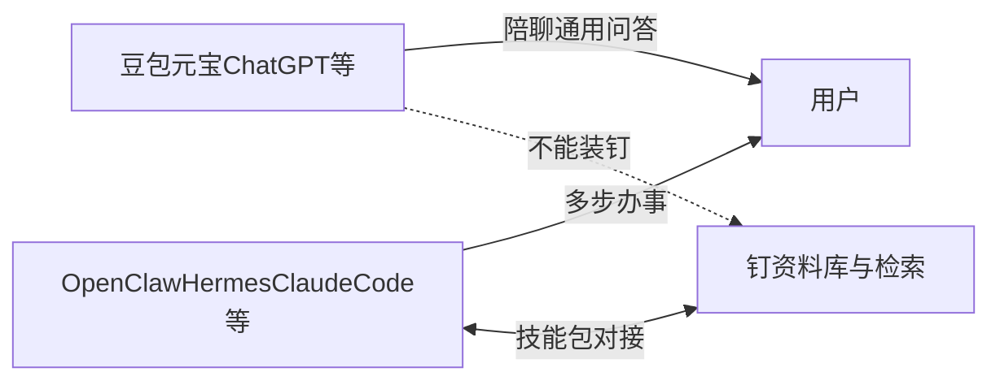

# 钉 — 项目介绍（精简版 · PPT 内容稿）

> **用途**：生成精简版演示文稿的内容底稿。  
> **受众**：业务负责人、部门主管等非技术决策者。  
> **建议篇幅**：6–9 分钟演讲，约 **11–12** 页幻灯片。

---

## 第 1 页 · 宣讲：ding 是什么？

### 1. ding 是什么？

**1.1 「钉」** — 代表给 AI 智能体提供资料的 **准确内容**。

**1.2 「叮」** — 代表知识从 **积累到融合** 后的 **顿悟感**。

---

**理论背景 · Andrej Karpathy**

**Andrej Karpathy** 是全球顶尖的人工智能与深度学习专家，曾先后在 **OpenAI**、**特斯拉（Tesla）** 等顶尖科技企业担任核心要职。他于 **2026 年 5 月** 正式加入 AI 独角兽企业 **Anthropic** 的预训练团队，专注于加速预训练研究与 **AI 自我进化**。

其在 **LLM-Wiki**（`llm-wiki.md`）中提出：AI 时代的知识管理，不应只在提问时「临时搜一下」，而应在 **摄入资料时就把知识编译好**——摘要、关联、更新、可核对，让知识 **越用越厚**。

智能体应担任 **资料库管理员**，而不是只会聊天的对话框。

**钉** 正是这一理论的 **践行平台**：保留原文、维护结构化笔记与关联、用 **钉技能包** 规范「入库—整理—检索—带出处作答」全流程。

---

## 第 2 页 · 三级演进：资料存档 → 资料库 → 决策库

| 阶段 | 您要解决的问题 | 钉在做什么 |
|------|----------------|------------|
| **资料存档** | 文件收进来、找得到 | 上传、预览、文件夹、资料目录索引 |
| **资料库** | 懂内容、能关联、能搜到 | 自动笔记、打标签、语义检索、标签关系图、持续进化 |
| **决策库** | 敢引用、能拍板、不胡编 | 智能体 **带文件名与原文摘录** 检索与综合，支撑业务判断 |

**演进方向**：从「堆文件」→「活知识」→「可信赖的决策依据」。钉推动平台沿这条路径 **一步步升级**。

---

## 第 3 页 · 钉是什么？

**钉** 是让 AI 智能体安全、可追溯地使用「本单位资料」的资料库与检索服务。

- **是**：资料存放、权限管理、精准找原文、**多格式自动提取笔记**、**网上资料自动整理入库**、教智能体怎么用库  

**多格式处理**（入库后自动转为可读笔记，供检索与引用）：

- **Office（新旧版本）**：Word（.doc / .docx）、Excel（.xls / .xlsx）、PowerPoint（.ppt / .pptx）  
- **PDF**：**可编排**（可选中文字的电子版）与 **图片版**（扫描件、拍照 PDF，自动 OCR 识别）  
- **图片**：JPEG、PNG、GIF、BMP、WebP 等常见格式  
- **不是**：聊天机器人（如豆包、元宝），也不是 ChatGPT 式问答框 — **钉不对接这类聊天产品**

**谁可以用钉？** 须使用支持 **标准 Skill** 的 **AI 智能体**，安装钉技能包后对接，例如：**OpenClaw（小龙虾）**、**Hermes**、**Claude Code**、**Codex**、**Cursor**，以及国内各大厂商的 **「龙虾」类智能体变体** 等。

**谁不能用钉对接？** **豆包、元宝** 等聊天工具 — 它们是一问一答的对话产品，**不支持** 安装钉技能包，**不是** 钉的使用入口。

对外统一称 **「钉」**；底层资料库平台为 FileX，使用者日常只需知道「钉」。

---

## 第 4 页 · 三个概念（速览）

> 聊天工具与智能体的详细对比见 **第 5 页**。

| 角色 | 是什么 | 和钉的关系 |
|------|--------|------------|
| **大模型**（豆包、元宝、ChatGPT 等） | 聊天产品里的「大脑」，擅长对话 | **不是钉的对接对象**；与钉是不同品类 |
| **智能体**（OpenClaw、Hermes、Claude Code、Codex 等） | 支持 Skill、能 **多步办事** 的 AI 助理 | **须用这类智能体 + 钉**；安装钉技能包后查库入库 |
| **钉** | 单位资料抽屉 + 精准翻页器 | **只检索原文片段，不替您 Chat 出答案** |

**RAG**（检索增强生成）：先找资料里最相关的段落，再让大模型组织回答。钉做前半段，降低瞎编风险。

---

## 第 5 页 · 普通聊天工具 vs AI 智能体（先分清两类产品）

很多人把 **豆包、元宝、ChatGPT** 和 **OpenClaw、Claude Code** 都叫作「AI」—— 其实是 **两种不同产品**。上钉之前，必须先分清。

### 普通聊天工具（Chat）

**代表**：豆包、元宝、ChatGPT、通义千问等  

**像什么**：在微信里和一位很博学的顾问 **聊天** — 您问一句，它答一句。  

**擅长**：日常问答、写作灵感、翻译润色、通用知识闲聊。  

**局限**：

- 默认 **不知道** 您单位内部未公开的资料  
- 很难稳定完成「下载 20 篇文献 → 入库 → 打标签 → 写带出处报告」这类 **多步流程**  
- **不能** 安装钉技能包 — **不是** 钉的对接入口  

### AI 智能体（Agent）

**代表**：OpenClaw（小龙虾）、Hermes、Claude Code、Codex、Cursor、国内 Skill 兼容「龙虾」变体等  

**像什么**：给助理 **派活** —「按主题在外网/PubMed 找文献、下载、入库、打标、再按库内证据写综述」。  

**擅长**：多步骤任务、调用工具（下载/上传/检索/写文件）、可审计的工作流。  

**与钉**：支持 **标准 Skill**，可安装 **钉技能包** — 查库、入库、带文件名与原文摘录作答。  

### 一表看清

| 维度 | 普通聊天工具 | AI 智能体 |
|------|-------------|-----------|
| 产品形态 | 聊天 App / 网页对话框 | Agent 运行环境（可装技能包） |
| 交互 | 一问一答 | 多步执行、可中途汇报进度 |
| 内部资料 | 最多临时上传几份文档问答 | 对接钉：长期资料库 + 全流程入库 |
| 能否用钉 | **不能** | **能**（须装钉技能包） |
| 典型场景 | 闲聊、写作 | 文献整理、内规查询、网上资料进库 |

**一句话**：**Chat 负责陪聊；Agent 负责办事；钉只给 Agent 提供可核对的内部资料。**

---

## 第 6 页 · 为什么智能体需要钉？

1. 办事必须读 **内部资料**，不能靠模型记忆  
2. 整库塞进对话 **不现实**（贵、慢、易泄密）  
3. 钉先 **检索证据**，再交给您选的大模型表述  

**OpenClaw、Hermes、Claude Code、Codex** 等 **智能体** 擅长跑流程；**豆包、元宝不能装钉** — 管内部资料须换用支持 Skill 的智能体。钉提供 **可信证据源**。

---

## 第 7 页 · 传统 RAG vs 钉

| 维度 | 传统 RAG | 钉 |
|------|----------|-----|
| 为谁设计 | 聊天框里「上传 + 问答」 | **AI 智能体** 工作流 |
| 谁出答案 | 常在平台里直接 Chat | **不在钉里代答**；证据给智能体 |
| 流程 | 企业 IT 自己拼 | 钉技能包约定入库、检索、打标 |
| 网上资料 | 需人工下载再上传 | **查找/下载 → 入库 → 笔记 → 标签 → 索引** |
| 知识形态 | 导入后易僵化 | **可进化**：上传、笔记、标签持续更新索引 |

**趋势**：2023–2024 传统 RAG 适配聊天；2024–2025 智能体驱动检索。**钉 = 智能体时代的 RAG 底座**。

---

## 第 8 页 · 三大亮点

**网上资料，一条龙入库**

给智能体一个 **主题或链接**（如 Web 外网检索、PubMed 文献检索、公开 PDF 下载地址），即可自动完成：**查找/下载 → 入库 → 提取可读笔记 → 打标签 → 建立检索索引**。网上零散资料变成库内可搜、可引用的正式知识，无需人工逐篇保存、转换、上传。

**知识可进化**

上传 → **多格式自动提取笔记**（Office 新旧版、可编排/图片版 PDF、图片等）→ 自动索引 → 目录同步；智能体可持续打标、补笔记；待处理清单看清「还没整理什么」。

**节点可联通**

标签关系图看主题团块；标签跳段落；目录索引鸟瞰全库。不是死文件夹，是 **主题—文件—段落** 可跳转的网络。

---

## 第 9 页 · 即插即用

钉技能包可从站点一键安装到 **OpenClaw、Hermes、Claude Code、Codex、Cursor** 等支持标准 Skill 的智能体环境，**即插即用**；安装后须配置 `FILEX_ORIGIN` 与 `fb_` API Key（Hermes：`~/.hermes/.env`）。

---

## 第 10 页 · 三句话总结

1. **钉践行 Karpathy LLM-Wiki 理论**，推动 **资料存档 → 资料库 → 决策库** 演进  
2. **须用支持 Skill 的智能体**（非豆包/元宝等聊天工具）+ 钉，才能查库、入库、带出处  
3. **比传统 RAG 更适合智能体**：只检索不代答、网上资料一条龙入库、库可进化、节点可联通
