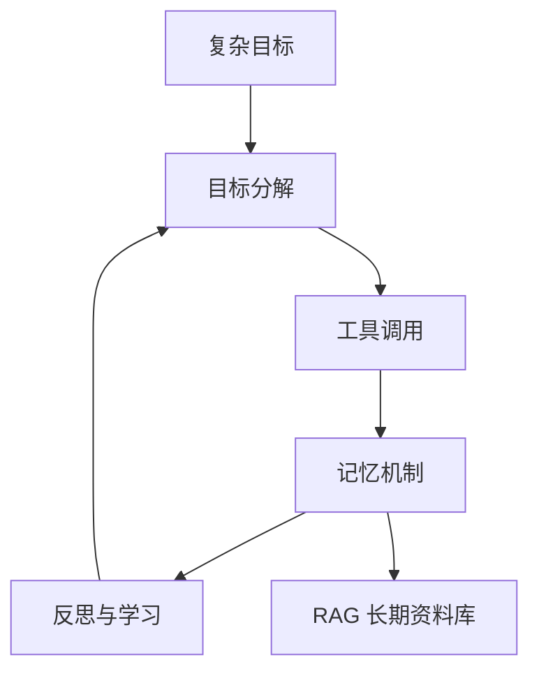

# 从 Chat（对话）到 Agentic（自主规划式智能体）：RAG（检索增强生成）如何让 AI 真正读懂企业

> **用途**：生成 15 页演示文稿的内容底稿。  
> **受众**：业务负责人、技术决策者、信息化部门。  
> **建议篇幅**：25–30 分钟演讲，**15** 页幻灯片。  
> **配套文档**：[RAG与Agentic演讲-完整逐字稿.md](./RAG与Agentic演讲-完整逐字稿.md)  
> **术语说明**：文中较少见的英文专业词均标注中文含义；完整对照见 [附录 D · 术语表](#附录-d--术语表中英文对照)

---

## 第 1 页 · 封面

**主标题**：从 Chat（对话）到 Agentic（自主规划式智能体）  
**副标题**：RAG（检索增强生成）如何让 AI 真正读懂企业

**演讲人 / 单位 / 日期**

**一句话预告**：

> 模型会换代，但企业 70% 的知识仍在沉睡。Agent 能行动，RAG 让它有据可依，钉！让这一切可落地。

---

## 第 2 页 · 我们到底在期待 AI 什么？

### 三个阶段的演进

| 阶段 | 本质 | 典型能力 | 局限 |
|------|------|----------|------|
| **Chat（对话）** | 对话式问答 | 多轮对话、文本生成 | 无行动能力，知识止于训练数据 |
| **Agent（智能体）** | 任务执行体 | 工具调用、多步执行 | 缺规划、反思与长期记忆 |
| **Agentic（自主规划式）** | 自主规划系统 | 目标分解、反思纠错、记忆积累 | 对私域数据与治理要求极高 |

### 一句话记忆

- **Chat 会说** → **Agent 会做** → **Agentic 会规划、会纠错、会积累**

### 本讲主线（预告）

```
大模型能力爆发 → Agent（智能体）能行动 → 企业数据在墙内 → RAG（检索增强生成）打通私域 → 钉！提供 Data+AI（数据+人工智能）底座
```

**讲者提示**：用 30 秒讲完表格，不要展开技术名词；重点是帮听众建立「演进」直觉。

---

## 第 3 页 · Agent 的优点：为什么企业开始押注

### 四大价值

1. **从问答到行动**  
   不只生成文字，还能查资料、调 API（应用程序接口）、跑代码、触发工作流。

2. **任务自动化**  
   检索、摘要、归类、填报等重复性知识工作可编排执行。

3. **能力可组合**  
   搜索 + 计算 + 企业系统 + 文档理解 = 「数字助理」雏形。

4. **持续迭代**  
   通过工具扩展与经验沉淀，能力可增长，而非一次性交付。

### 视觉建议

- 左侧：Chat 对话框（静态）  
- 右侧：Agent 流程图（检索 → 执行 → 回写）  
- 中间箭头：**从「说」到「做」**

**讲者提示**：举 1 个业务例子——「帮我整理本周竞品动态并写入纪要」。

---

## 第 4 页 · Agent 的边界：四个必须正视的硬伤

| 问题 | 表现 | 根因 |
|------|------|------|
| **私域数据不可及** | 答不出内部制度、项目文档 | 训练数据以公网为主 |
| **幻觉（Hallucination，胡编乱造）** | 捏造政策、虚构引用 | 生成模型是概率预测，非事实检索 |
| **上下文有限** | 长文档、跨项目知识装不下 | Token（词元）窗口与成本约束 |
| **缺乏治理与溯源** | 不知答案来自哪份文件 | Chat 模式缺少引用链与权限边界 |

### 数据可见性（常被引用的比例）

```
公网（明网，Surface Web）  ≈ 20%
深网（Deep Web）/ 私域 / 企业内部  ≈ 70%+
```

### 本页金句

> Agent 再强，若接不上企业自己的数据，上限就是「更聪明的公网助手」。

**讲者提示**：停顿 2 秒，让「70%」数字沉淀；这是引出 RAG 的桥。

---

## 第 5 页 · Agentic 智能体：四大核心能力

### 架构示意



### 能力拆解

| 能力 | 做什么 | 与 RAG 的关系 |
|------|--------|---------------|
| **目标分解** | 大任务拆成可执行子步骤 | 每步可能检索不同知识切片 |
| **工具调用** | 搜索、API、代码、企业系统 | 资料库 API 是核心工具之一 |
| **记忆机制** | 短期上下文 + 长期沉淀 | **RAG = 长期记忆的按需召回层** |
| **反思与学习** | 自检、换路、重规划 | 检索为空时扩召回或降级人工 |

### 本页金句

> Agentic = LLM（大语言模型）+ 规划 + 工具 + **RAG（检索增强生成）记忆** + 反思闭环

---

## 第 6 页 · AI 进化的两个维度

### 维度一：大模型（LLM）在进化

| 能力 | 演进 | 企业意义 |
|------|------|----------|
| **多模态** | 文本 → 图 / 音 / 视频 | 扫描件、会议录音可入库 |
| **Tools（工具调用）** | 原生 function calling（函数调用） | 与 Agent 编排更顺滑 |
| **Think（深度思考）** | 推理链、慢思考 | 复杂调度质量提升 |

### 维度二：智能体（Agent）系统在进化

**大小模型协作**

```
小模型 → 预处理、分类、摘要、路由（低成本）
大模型 → 推理、规划、复杂生成（高质量）
专业模型 → OCR（光学字符识别）、ASR（自动语音识别）、领域专家（各司其职）
```

**三件实事**

1. 私域数据接入 — **RAG 成为标配**  
2. 工具库持续扩展 — MCP（模型上下文协议）、API、技能包  
3. 经验沉淀 — Wiki、标签、知识图谱  

**讲者提示**：强调「模型月月新，但企业不应把战略押在追榜单上」。

---

## 第 7 页 · 企业 AI 落地：Gartner 视角下的现实

### 战略重心转移

| 过去 | 现在 |
|------|------|
| 追逐最新大模型榜单 | **数据资产化 + 知识工程 + Agent 编排** |
| POC（概念验证）演示「能聊天」 | 生产环境「能溯源、能授权、能运维」 |

### 三类典型痛点

1. **数据沉睡** — 70–90% 非结构化数据（PDF、邮件、纪要、制度）AI 不可读  
2. **数据孤岛** — 多系统、多格式，精力耗在搬运与格式转换  
3. **治理缺失** — 谁可见、哪版为准、答案能否审计，比模型大小更影响上线  

### 落地公式

```
企业 AI 价值 = 私域数据质量 × RAG/图谱能力 × Agent 编排 × 安全治理
```

**视觉建议**：四象限或公式居中，痛点用图标排列在下方。

---

## 第 8 页 · RAG 是什么？在企业 Agent 中的位置

### RAG 不是什么

- ❌ 不是「把 PDF 扔进向量库」就完事  
- ❌ 不是 fine-tuning（微调）的万能替代  

### RAG 是什么

**检索增强生成（Retrieval-Augmented Generation）**  
在生成前，从**授权资料库**召回相关证据，再让模型**基于证据**回答。

### 四层成熟度

| 层级 | 能力 | 典型特征 |
|------|------|----------|
| L1 基础 | 分块 + 向量检索 + 引用 | 能答，但召回率一般 |
| L2 增强 | 混合检索、重排序（Rerank）、查询扩展 | 中文长句、文件名加权 |
| L3 知识工程 | Wiki 互链、标签图谱、主题页 | 知识可演进、可关联 |
| L4 Agentic | 检索 → 判断不足 → 再检索 / 扩上下文 | 与 Agent 规划闭环 |

**讲者提示**：用「开卷考试」类比——模型是考生，RAG 是允许带的「企业参考资料」。

---

## 第 9 页 · 钉！定位：Data + AI 平台

### 一句话定位

**钉！** = 企业私域知识的采集、治理、检索与 Agent 技能交付平台。

### 解决什么问题？

| 企业痛点 | 钉！回答 |
|----------|------------|
| 资料散、格式杂 | 统一摄取 → 资料笔记 → 可检索语料 |
| 怕 AI 胡编 | RAG 带 workspace（工作空间）隔离与引用溯源 |
| Agent 难落地 | 规范化技能包（钉技能），开箱即用 |
| 知识不进化 | Wiki + 标签图谱，越用越厚 |

### 与 Chat 产品的边界

- 钉！**不是** 又一个聊天窗口  
- 钉！**是** 智能体背后的「知识底座 + 治理层」

**视觉建议**：三层架构图 — 数据层 / 知识层 / Agent 层。

---

## 第 10 页 · 钉！六大平台能力

| # | 能力 | 内涵 | 听众可感知价值 |
|---|------|------|----------------|
| 1 | **云原生架构** | 容器化、PostgreSQL + 消息队列 + 索引服务 | 易部署、易扩容 |
| 2 | **可组装架构** | 摄取、索引、检索、Wiki、Agent API 解耦 | 按场景拼装 |
| 3 | **一站式交付** | 上传 → 提取笔记 → 向量索引 → Web / 钉技能 | 少自建 RAG 管线 |
| 4 | **统一治理** | 工作空间隔离、ACL（访问控制列表）、操作日志、API Key（接口密钥） | 合规可审计 |
| 5 | **规范化技能** | 库内检索、文献入库、Wiki 体检等 Skill（技能包） | Agent 开箱即用 |
| 6 | **2AI 标准化文档** | 面向人与 AI 双消费的 Markdown（轻量标记文档）语料 | 资料可演进、可互链 |

**讲者提示**：不必逐条念表；挑 3、4、5 展开 30 秒，其余一带而过。

---

## 第 11 页 · 知识如何「进化」：钉！差异化

### 知识飞轮


### 关键机制

- **资料笔记流水线**：PDF / Office / 图片 OCR → 统一 Markdown，结构化提取  
- **Wiki 互链**：`[[file:id]]` / `[[wiki:slug]]`，概念页编译与体检  
- **标签关系图**：共现力导向图，支持 AND 筛选  
- **混合检索**：向量语义检索 + FTS（全文检索），可评测调优  

### 本页金句

> 知识不是静态仓库，而是随整理、链接、使用而进化的网状体系。

---

## 第 12 页 · 钉！带来的业务收益

### 四大收益

1. **多源私域数据规范化**  
   网盘、邮件附件、项目文档 → 统一可检索语料。

2. **可挖掘、可关联**  
   不只「找到文件」，还能「找到关系」—— 标签、Wiki、共引。

3. **Agent 可信回答**  
   RAG 按工作空间与 ACL 过滤，回答可带出处。

4. **人机协作闭环**  
   人整理 Wiki / 打标签 → 库变聪明 → Agent 更好用 → 人更愿意沉淀。

### 典型场景（可选展示）

- 研发：内部规范 + 历史项目检索  
- 合规：制度问答带原文引用  
- 智能体：钉技能库内搜 + 外网文献入库一条龙  

---

## 第 13 页 · 安全与合规：准入门槛

### 数据安全

| 要求 | 钉！思路 |
|------|------------|
| 非公开数据不出域 | 私有化部署 + 内网 RAG |
| 最小权限 | 个人 / 共享工作空间、资源授权（ACL） |
| 可审计 | 操作日志、API Key 上下架、分享溯源 |

### 模型安全

- **LLM 本地化**：Ollama 等内网推理，敏感内容不外发  
- **模型与数据解耦**：换模型不丢资料库；权限独立于模型  

### 本页金句

> 安全不是 Agent 的附加项，而是准入门槛。

**讲者提示**：政企听众在此页可多停留 1 分钟。

---

## 第 14 页 · 建设成本：如何算清账

### LLM 成本结构

| 模式 | 成本项 | 特点 |
|------|--------|------|
| **云端 API** | 按 Token（词元）计费 | 弹性好；需评估数据出境与长期费用 |
| **本地部署** | GPU（图形处理器）/ CPU + 运维 | 前期投入高；适合强合规、高并发 |

### 常被忽略的隐性成本

- 自建 RAG 管线（解析、分块、索引、评测）的人力  
- 多数据源对接与格式清洗  
- Agent 技能维护与版本管理  

### 钉！私有化部署的价值主张

- **摊薄工程成本** — 摄取、索引、检索、Wiki、Agent API 已产品化  
- **模型可替换** — 避免 vendor lock-in（厂商锁定）  
- **规模经济** — 库越大，Agent 边际价值越高  

**视觉建议**：TCO（总拥有成本）对比简表 — 「自建 6 个月」vs「钉！ 4 周试点」。

---

## 第 15 页 · 总结与行动建议

### 给听众的三句话

1. **模型会换代，企业数据不会自动变聪明** — 资产化才是主战场。  
2. **Agent 的未来在 Agentic，但可信度在 RAG 与治理**。  
3. **钉！不是又一个 Chatbot（聊天机器人），而是让 Agent 站在企业知识之上。**

### 建议试点路径（Call to Action，行动号召）

```
第 1 周：选定 1 个知识空间 + 导入核心文档（制度 / 项目 / 产品）
第 2 周：跑通资料笔记与语义检索，人工抽检引用质量
第 3 周：接入 1 个钉技能场景（如库内检索 / 文献入库）
第 4 周：评测检索效果，迭代标签与 Wiki 结构
```

### Q&A 预埋

- RAG 和 Fine-tuning（微调）怎么选？  
- 幻觉能降到 0 吗？  
- 小团队如何起步？  

**结束语**：欢迎交流试点方案与私有化部署评估。

---

## 附录 A · 幻灯片设计建议

| 页码 | 版式 | 主视觉 |
|------|------|--------|
| 1 | 封面全屏 | 演进时间线底纹 |
| 2–4 | 左文右图 | 三阶段图标 / 痛点四宫格 |
| 5 | 居中架构图 | Mermaid 转图 |
| 6–8 | 表格 + 公式 | 对比色强调「70%」「RAG」 |
| 9–12 | 平台架构 + 飞轮 | 钉！ logo + 三层架构 |
| 13–14 | 双栏对比 | 盾牌图标（安全）+ 硬币图标（成本） |
| 15 | 三句话 + CTA | 试点路径时间轴 |

## 附录 B · 时间分配参考（总计约 28 分钟）

| 页码 | 主题 | 建议时长 |
|------|------|----------|
| 1–2 | 开场与演进 | 3 min |
| 3–4 | Agent 价值与边界 | 5 min |
| 5–6 | Agentic 能力与 AI 进化 | 5 min |
| 7–8 | 企业落地与 RAG | 5 min |
| 9–12 | 钉！平台与收益 | 8 min |
| 13–14 | 安全与成本 | 4 min |
| 15 | 总结与 Q&A 过渡 | 3 min |

## 附录 C · 与现有材料的关系

- 产品细节可参考：[钉-项目介绍-标准版.md](../钉-项目介绍-标准版.md)  
- 已有 PPT 素材：[FileX和AI智能体以及RAG入门介绍.pptx](../FileX和AI智能体以及RAG入门介绍.pptx)（可合并视觉）  
- 技术深度扩展：[kb-index-agent.md](../../kb-index-agent.md)、[design-wiki-interlink.md](../../archive/design-wiki-interlink.md)

## 附录 D · 术语表中英文对照

| 英文 | 中文 | 一句话解释 |
|------|------|------------|
| Chat | 对话 | 一问一答，无行动能力 |
| Agent | 智能体 | 能调用工具、执行多步任务 |
| Agentic | 自主规划式智能体 | 会分解目标、反思纠错、积累经验 |
| RAG | 检索增强生成 | 先查企业资料库，再基于证据生成回答 |
| LLM | 大语言模型 | 如 GPT、Claude、通义等文本生成底座 |
| Token | 词元 | 模型计费与上下文长度的基本单位 |
| Prompt | 提示词 | 发给模型的指令与上下文 |
| API | 应用程序接口 | 系统之间程序化调用的标准入口 |
| function calling | 函数调用 | 模型按结构化格式触发外部工具 |
| MCP | 模型上下文协议 | 智能体连接外部工具的统一标准 |
| OCR | 光学字符识别 | 从图片、扫描件中提取文字 |
| ASR | 自动语音识别 | 将语音转为文字 |
| ACL | 访问控制列表 | 规定谁可读/写哪些资源 |
| POC | 概念验证 | 小规模试点，验证可行性 |
| fine-tuning | 微调 | 用企业数据继续训练模型参数 |
| embedding / 向量化 | 向量化 | 把文本转为可语义检索的数值向量 |
| 向量库 | 向量数据库 | 存储与检索向量化后的知识片段 |
| FTS | 全文检索 | 按关键词匹配文档（传统搜索） |
| Rerank | 重排序 | 对初步检索结果二次精排 |
| workspace | 工作空间 | 个人库或集团共享库等隔离单元 |
| Skill | 技能包 | 智能体可安装的标准化能力模块 |
| Markdown | 轻量标记文档 | 人可读、AI 易解析的 `.md` 格式 |
| hallucination | 幻觉 | 模型编造不存在的事实 |
| grounding | 据实作答 | 回答锚定在检索到的真实资料上 |
| vendor lock-in | 厂商锁定 | 被单一供应商绑定、难以替换 |
| TCO | 总拥有成本 | 含采购、部署、运维、升级的全程费用 |
| SOTA | 最先进 | State of the Art，当前榜单最优水平 |
| Chain of Thought | 思维链 | 把推理过程拆成可见步骤 |
| ReAct | 推理-行动 | 交替「思考 → 调用工具 → 观察结果」 |
| ETL | 抽取-转换-加载 | 数据从源系统搬运并格式统一的过程 |
| Chatbot | 聊天机器人 | 纯对话产品，通常无企业私域知识 |
